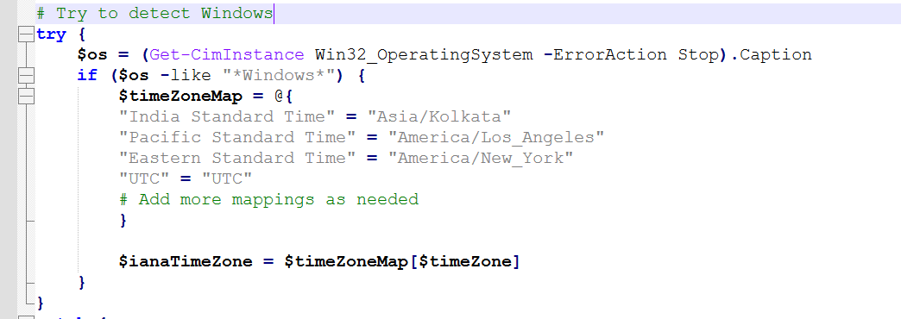
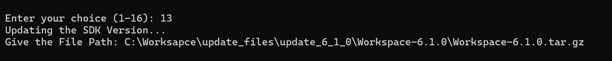

# Evalkit Config Utility

This repository contains a PowerShell script `Evalkit_Config_Utility.ps1` that opens a system utilities homepage with quick-access choices for common system tasks. It is compatible with both **Windows** and **Ubuntu** systems using PowerShell Core.

---

## Installing PowerShell

### On Ubuntu

Install PowerShell using Snap:

```bash
sudo snap install powershell --classic
```
Launch PowerShell with:
```bash
pwsh
```
---

## Usage

Run Script on PowerShell terminal:
```bash
./Evalkit_Config_Utility.ps1
```

---

## Available Actions

- **ADSD3500 Reset**<br>
   Resets the ADSD3500.

- **Get File System Permission**<br>
   Displays the file system permission status: either Read-Write (**RW**) or Read-Only (**RO**). For **RO**, data saved to files will persist only until the next reboot.

- **Modify File System Permission**<br>
   Changes the file system permission between Read-Write(**RW**) and Read-Only(**RO**).

- **Get Date and Time**<br>
   Displays the current date and time of the Eval-kit.

- **Set Date and Time**<br>
   Sets the host's current date and time on the Eval-kit.<br>
   **Note**: On Windows, if your time zone is not configured in `set-server-time.ps1`, it will default to "UTC". To add your time zone, update the mappings in `set-server-time.ps1.` :

   


- **Check Wifi Connection**<br>
   Checks the Wi-Fi connection on the Eval-kit. If Wi-Fi is not connected, use "Setup Wi-Fi" to configure it.<br>
   **Note**: Ensure your internet connection is active while Wi-Fi is connected.

- **Setup Wifi**<br>
   Configures Wi-Fi using SSID and Password.<br>
   **Note**: This will reboot the Eval-kit. Make sure all files are saved before proceeding.

- **Check Firmware Version**<br>
   Displays the current firmware version on the Eval-kit.

- **Update Firmware**<br>
   Updates the firmware using a .bin file.<br>
   **Note**: Ensure the SHA-256 checksum file is saved with the same name and .sha256 extension in the same directory as the firmware file.<br>
   Example: In below Path filename is `Fw_Update_5.3.3.bin` so the SHA-256 filename should be `Fw_Update_5.3.3.bin.sha256` and the location of SHA-256 is same where the firmware file is located.
   ```
   Give the Firmware Path: C:\Worksapce\Web-UI\ps_scripts\Firmware\Fw_Update_5.3.3.bin
   ```
   

- **Get SDK Version**<br>
   Displays the current SDK version on the Eval-kit.
   
- **Update SDK Version**<br>
   Updates the SDK using a .tar.gz file.<br>
   **Note**: Ensure the SHA-256 checksum file is saved with the same name and .sha256 extension in the same directory as the SDK file.<br>Example: In below Path filename is `Workspace-6.1.0.tar.gz` so the SHA-256 filename should be `Workspace-6.1.0.tar.gz.sha256` and the location of SHA-256 is same where the SDK file is located.
   ```
   Give the File Path: C:\Worksapce\Web-UI\ps_scripts\Workspace-6.1.0.tar.gz
   ```
   

- **Switch SDK Version**<br>
   Allows switching between available SDK versions based on user selection.

- **Network Switch**<br>
   Switches the network configuration based on the operating system (Windows/Ubuntu).
   By default, it is set for Windows. If switching OS, ensure the network is configured accordingly.
---

## Known Issue

   PowerShell scripts may show an error if they are not unblocked.

   ```
   Filename.ps1 is not digitally signed. You cannot run this script on the current system. For more information about running scripts   and setting execution policy, see about_Execution_Policies at
   ```

   **Resolution** : To resolve this issue, run :
   ```
   Unblock-File -Path .\Filename.ps1
   ```
   To unblock multiple files from the parent folder :
   ```
    Unblock-File -Path .\*
   ```

---
