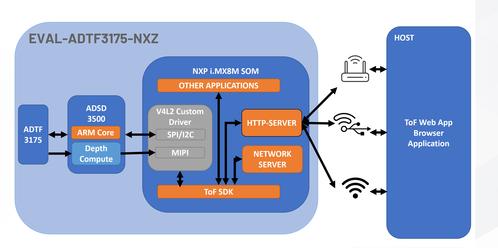
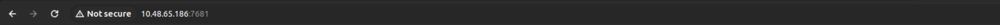
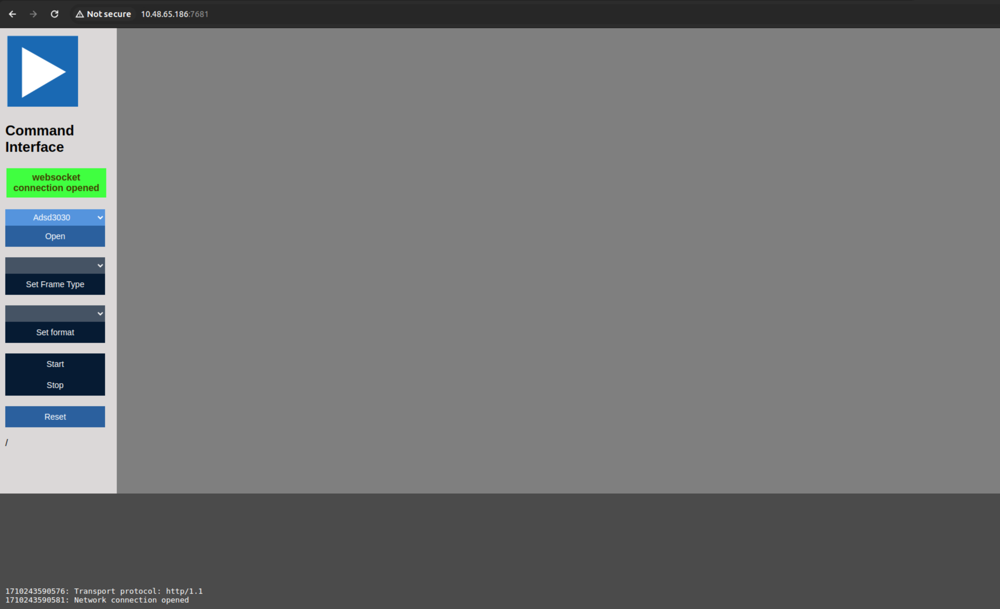
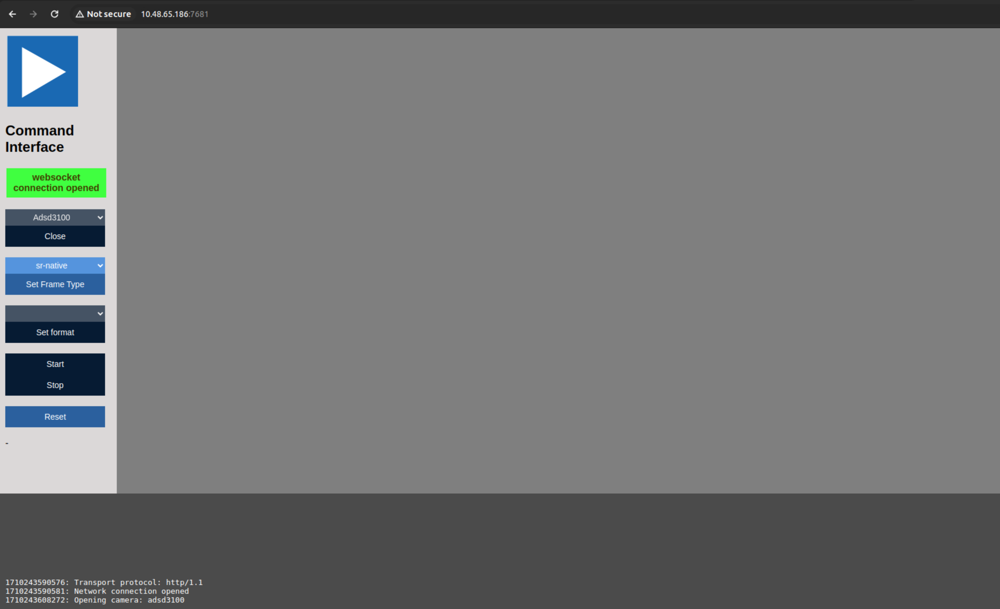
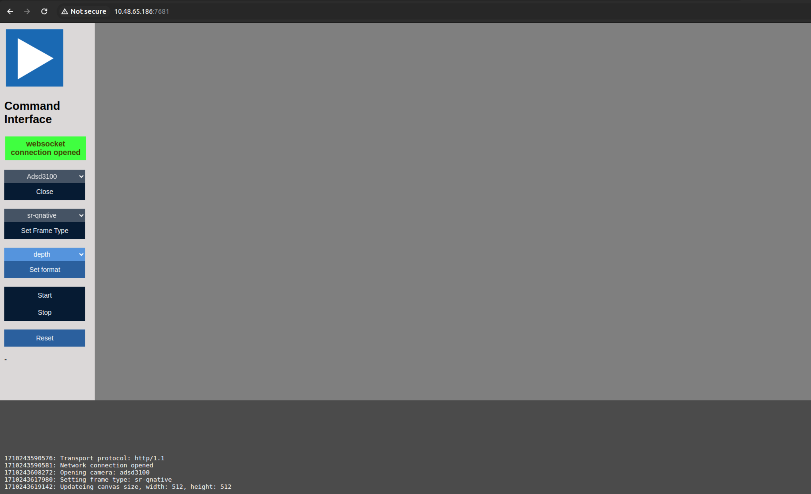
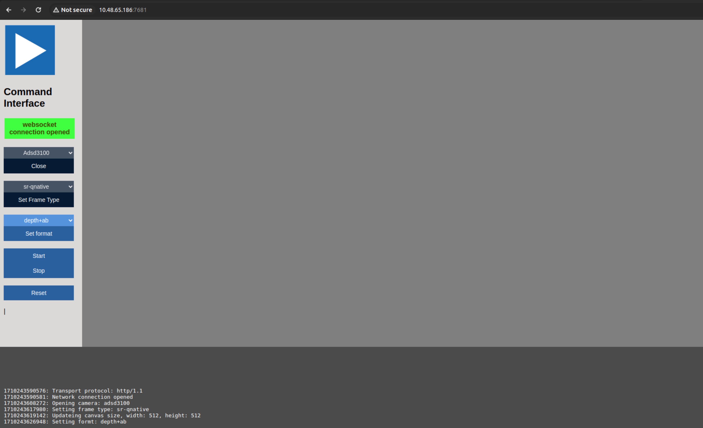
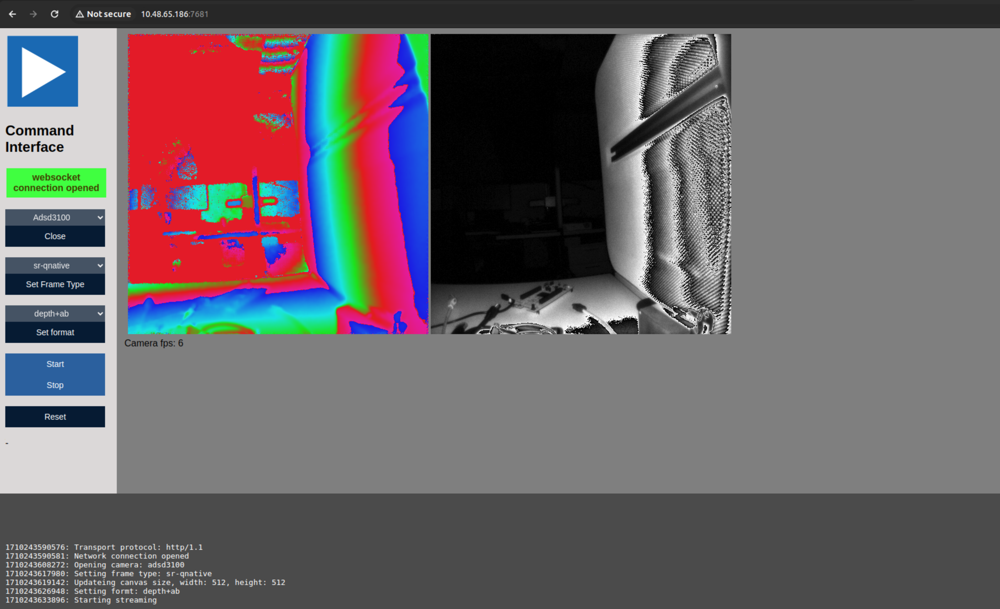

## HTTP-Network server

With the help of this http-server the user is able to connect to camera via http protocol, to configure and request frames from the Time of Flight module using the SDK on target.

Limitations:
- port 7681 is reserved for this communication


## Structure overview




## Start server

To build the SDK together with http-server:

```console
cmake -DNXP=1 -DWITH_HTTP_SERVER=1 -DCMAKE_PREFIX_PATH="/opt/glog;/opt/protobuf;/opt/websockets" ..
make
```
To start the server on the target run the following command:
```console
./build/apps/http-server/aditof-http-server
```


## UI interface

* Enter IP address:


* Select camera:


* Select frame type:


* Select frame format:


* Start/Stop state:


* Streaming:
