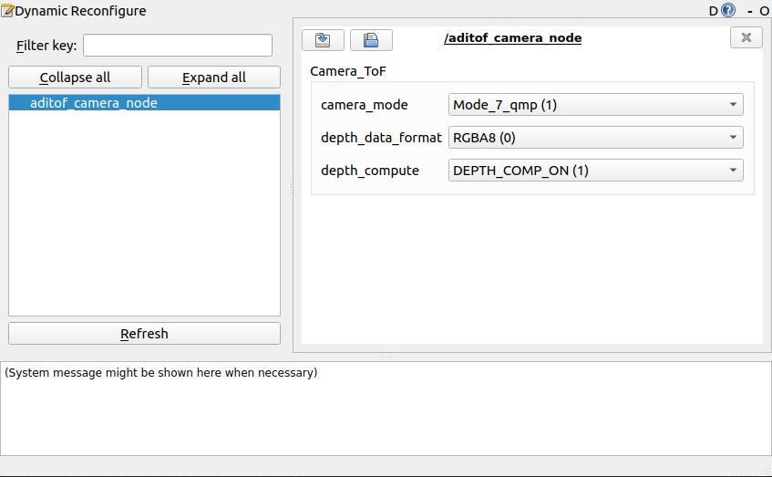

# ROS Wrapper for the ADI ToF library

## Overview
This ROS package facilitates depth and IR data acquisition and processing for the Analog Devices depth cameras.

## Installation

- **Install the recommended [ROS distribution](http://wiki.ros.org/Distributions) for your operating system**
  - [ROS Install page](http://wiki.ros.org/ROS/Installation)
- **Make sure you have these ROS packages installed before building and running the examples**
  - [rviz](http://wiki.ros.org/rviz)\
    Run the command below for each package, replacing ROSDISTRO with the name of the ROS distribution you are using and PACKAGE with the name of the needed package.
  ```console
  sudo apt install ros-ROSDISTRO-PACKAGE
  ```
- **Install the ADI ToF SDK library**
  - [Install SDK dependencies](https://github.com/analogdevicesinc/aditof_sdk/blob/6c7fb376aeec73a21ab177adf297c5781bcbd544/doc/linux/build_instructions.md#installing-the-dependencies)
  - Download and build the SDK, as well as enable ROS package building
```console
git clone https://github.com/analogdevicesinc/ToF
cd ToF
mkdir build && cd build
cmake -DWITH_NETWORK=1 -DWITH_ROS=on -DCMAKE_PREFIX_PATH="/opt/glog;/opt/protobuf;/opt/websockets" ..
sudo cmake --build . --target install
```
 - **Build the aditof_roscpp package**
  ```console
  sudo cmake --build . --target aditof_ros_package
  ```


## Usage
### Starting camera node
* For <b>USB</b> type camera connections with RQT dynamic reconfigure GUI use the following commands:
    ```console
    cd catkin_ws
    source devel/setup.bash
    roslaunch aditof_roscpp camera_node_gui.launch config_file:="<path>"
    ```
    
The path should point towards the appropriate config file for the cameras. 
* For <b>Ethernet\Wi-Fi</b> connections, you should specify the camera's IP address, using the ip parameter, as shown below:

    ```console
    cd catkin_ws
    source devel/setup.bash
    roslaunch aditof_roscpp camera_node_gui.launch ip:="124.0.0.0" config_file:="<path>"
    ```
    
 <p align="center"></p>
 
### Without RQT Reconfigure
* For <b>USB</b> type camera connections witouth RQT dynamic reconfigure GUI use the following commands:
    ```console
    cd catkin_ws
    source devel/setup.bash
    roslaunch aditof_roscpp camera_node.launch config_file:="<path>" mode:="1" use_depthCompute:="false"
    ```
The path should point towards the appropriate config file for the cameras, mode should be selected as follows:
  - mode: pcm = 0
  - mode: qmp = 1 
  - mode: mp = 2 </br>
The use of depthCompute libraries can be modified by setting the ```use_depthCompute``` variable to ```true```/```false```
* For <b>Ethernet\Wi-Fi</b> connections, you should specify the camera's IP address, using the ip parameter, as shown below:
    ```console
        cd catkin_ws
    source devel/setup.bash
    roslaunch aditof_roscpp camera_node.launch ip:="124.0.0.0" config_file:="<path>  mode:="1" use_depthCompute:="false"
    ```
The path should point towards the appropriate config file for the cameras, mode should be selected as follows:
  - mode: pcm = 0
  - mode: qmp = 1 
  - mode: mp = 2 </br>
The use of depthCompute libraries can be modified by setting the ```use_depthCompute``` variable to ```true```/```false```

### Examples
  - Visualize point cloud in rviz
    ```console
    cd catkin_ws
    source devel/setup.bash
    roslaunch aditof_roscpp rviz_publisher.launch
    ```

 ### ***Note:***
 *In case you wish to launch nodes using the rosrun command instead of roslaunch, you should run each node specified in the launchfile in a different terminal. For example, this line*
```console
roslaunch aditof_roscpp camera_node.launch ip:="127.0.0.1"
```
*will be replaced with these lines*

```console
roscore
rosrun aditof_roscpp aditof_camera_node 127.0.0.1
rosrun rqt_reconfigure rqt_reconfigure
```
## Published Topics
The aditof_camera_node publishes messages defined by the [sensor_msgs](http://wiki.ros.org/sensor_msgs) package on the following topics
- /aditof_roscpp/aditof_camera_info
- /aditof_roscpp/aditof_depth
- /aditof_roscpp/aditof_ir
- /aditof_roscpp/aditof_pcloud

## Update parameters at runtime using
Using the [dynamic_reconfigure](http://wiki.ros.org/dynamic_reconfigure) package, the aditof_ros_package offers the users the possibility to update the camera parameters

