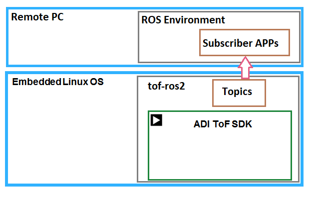
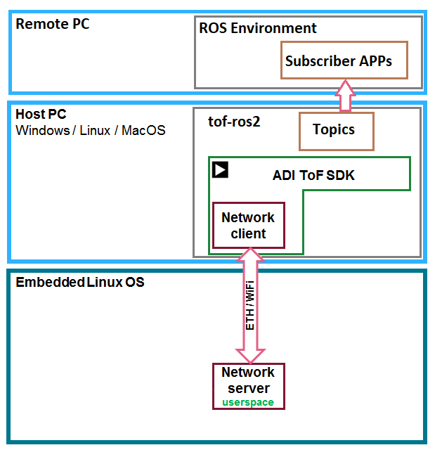

# ROS2 Wrapper for Time of Flight SDK of Analog Devices

## ROS 2 Wrapper exists in an external repository for general package implementations: [External repository](https://github.com/analogdevicesinc/tof-ros2)

# 1. Install ROS2

- Install the recommended [ROS2 distribution](https://docs.ros.org/en/rolling/Releases.html) for your operating system**
  - [ROS Install page](https://docs.ros.org/en/foxy/Installation.html)

- In order to prepare the system to run the ROS wrapper in the general catkin workspace make sure to install correctly the following libraries:

# 2. ToF dependency


- [Install SDK dependencies](../../doc/itof/linux_build_instructions.md)

```console
git clone https://github.com/analogdevicesinc/ToF
cd ToF
mkdir build && cd build
```
* In case you have the Depth-Compute library for the SDK, use the following command:
```console
cmake -DWITH_NETWORK=1 -DWITH_ROS2=on -DROS_HOME_DIR="/home/${USER}/.ros" -DCMAKE_PREFIX_PATH="/opt/glog;/opt/protobuf;/opt/websockets" -DUSE_DEPTH_COMPUTE_STUBS=0 ..
```
* Otherwise, if the Depth-Compute library is not added, plese use the following command:
```console
cmake -DWITH_NETWORK=1 -DWITH_ROS2=on -DROS_HOME_DIR="/home/${USER}/.ros" -DCMAKE_PREFIX_PATH="/opt/glog;/opt/protobuf;/opt/websockets" -DUSE_DEPTH_COMPUTE_STUBS=1 ..
```

```console
sudo cmake --build . --target install
```
- **Build the aditof_roscpp package**
```console
sudo cmake --build . --target tof_ros2_package
```

# 3. Usage

For usage information please refere to ```section 3``` from: [ROS Usage](https://github.com/analogdevicesinc/tof-ros2#3-usage)

# 4. Diagrams




