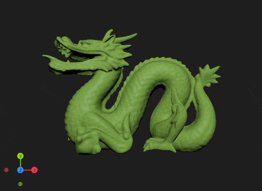
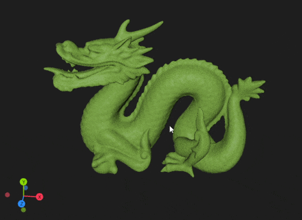

# ImOGuizmo
A simple C++11 header only interactive orientation gizmo for ImGui. 

## Usage
```c++
#include "imoguizmo.hpp"

// it is recommended to use a separate projection matrix since the values that work best
// can be very different from what works well with normal renderings
// e.g., with glm -> glm::perspective(glm::radians(90.0f), 1.0f, 0.1f, 1000.0f);

// optional: configure color, axis length and more
// ImOGuizmo::config.axisLengthScale = 1.0f;

// specify position and size of gizmo (and its window when using ImOGuizmo::BeginFrame())
ImOGuizmo::SetRect(0.0f /* x */, 0.0f /* y */, 120.0f /* square size */);
ImOGuizmo::BeginFrame(); // to use you own window remove this call 
// and wrap everything in between ImGui::Begin() and ImGui::End() instead

// optional: set distance to pivot (-> activates interaction)
if(ImOGuizmo::DrawGizmo(viewMatrix, projMat, pivotDistance /* optional: default = 0.0f */))
{
	// in case of user interaction viewMatrix gets updated
}
```
### Note
Use `#define IMOGUIZMO_LEFT_HANDED` in case you are using a left handed coordinate system, otherwise right handed is used. (untested)
Use `#define IMOGUIZMO_Z_UP` in case your coordinate system has the z axis point up, otherwise y is used.


Drag|Click
:-:|:-:
  |  

[License (MIT)](https://github.com/fknfilewalker/imoguizmo/blob/main/LICENSE)
