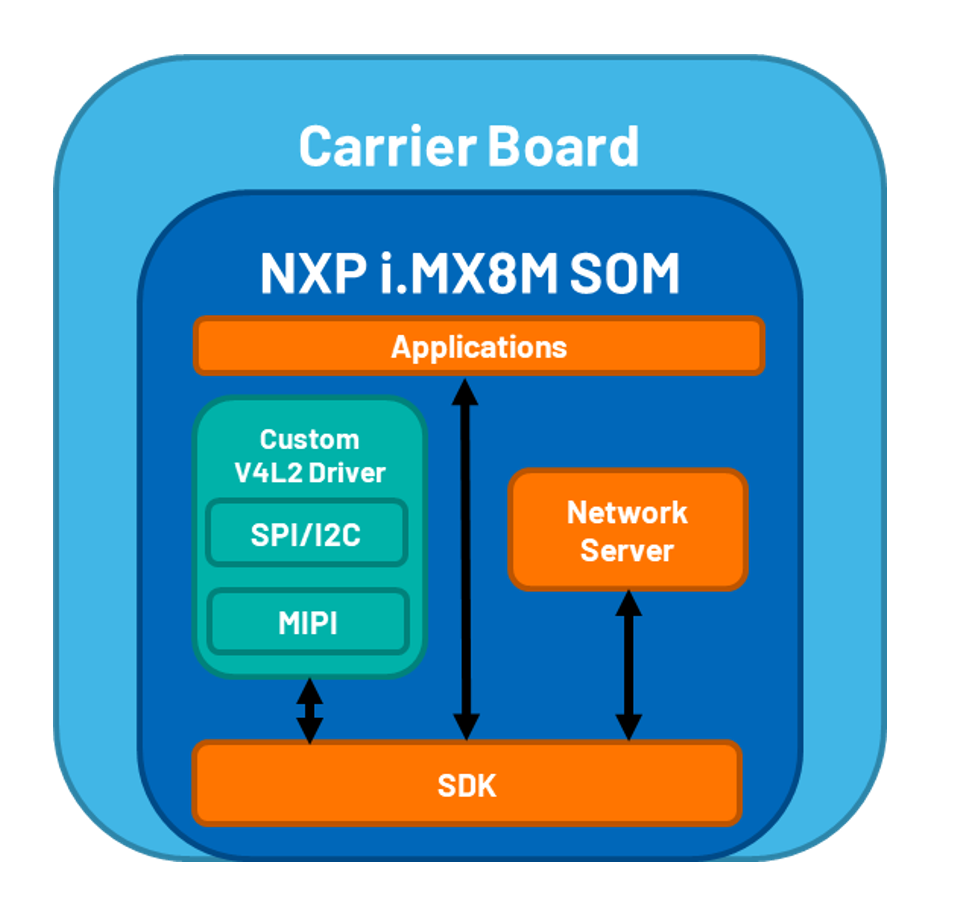
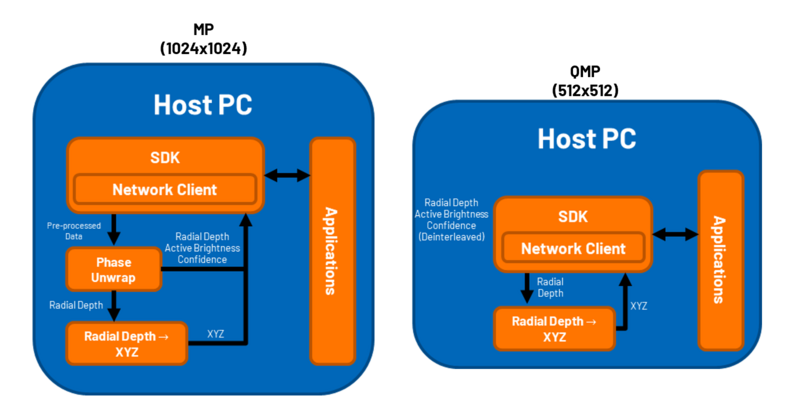

:orphan:

.. _EVAL-ADTF3175D-NXZ-Block-Diagram:

EVAL-ADTF3175D-NXZ Block Diagram
================================

.. toctree::
   :maxdepth: 2
   :caption: Contents:

   ADTF-NVM

This page provides a high level overview of the EVAL-ADTF3175D-NXZ evaluation platform. This system showcases the ADTF3175 ToF module as well as the ADSD3500 depth ISP.

.. image:: _static/pulsatrix_mp.png
   :class: bordered-image
   :width: 50%
   :align: center

.. image:: _static/pulsatrix_qmp.png
   :class: bordered-image
   :width: 50%
   :align: center

ADTF3175D
---------

The ADTF3175 is a complete Time-Of-Flight (ToF) module for high resolution 3D depth sensing and vision systems. Using the ADSD3100 ToF image sensor, the ADTF3175 also integrates the lens and optical band-pass filter for the imager, an infrared illumination source containing optics, laser diode driver and photodetector, a flash memory, and power regulators to generate local supply voltages.

Simplified Block Diagram
~~~~~~~~~~~~~~~~~~~~~~~~

For full block diagram please refer to datasheet

* TODO: Link to ADSD3100 datasheet 
* :ref:`ADTF-NVM`

NVM Contents
~~~~~~~~~~~~

* ADSD3100 FW
* ADTF3175 module calibration
* ADSD3500 FW

TODO: Click here NVM structure details

EVAL-ADTF3175D-NXZ Usecase
~~~~~~~~~~~~~~~~~~~~~~~~~~

After the ADSD3500 is booted up, and the ADTF3175 is powered up. The ADSD3500 reads the contents of the ADTF3175 NVM and programs the ADSD3100 with the ADSD3100 FW as well as some calibration parameters.

Once the ADSD3100 on the module is configured, FSYNC is provided by the ADSD3500 to capture frames. The imager outputs data via MIPI (4-Lane upto 1.464 Gbps per lane).

ADSD3500
--------

The ADSD3500 is a depth ISP, designed to compute the raw data of the ADSD3100 and ADSD3030 ToF imagers into Radial Depth and Active Brightness (AB) frames. The ADSD3500 greatly lightens the load on the host processer and makes it simpler to implement applications at the edge.

* TODO: Product Page
* TODO: IMAGE OF ADSD3500

Simplified Block Diagram
~~~~~~~~~~~~~~~~~~~~~~~~

For full block diagram please refer to datasheet

* Link to ADSD3500 datasheet

EVAL-ADTF3175D-NXZ Usecase
--------------------------

The ADSD3500 is installed on an adaptor designed to configure the part in multiple ways. In the ADTF3175D configuration, the NXP SOM configures the ADSD3500 to self boot. In this mode, the depth ISP reads the contents of the ADTF3175 NVM and programs it self with the included FW. It then programs the ADSD3100 on the ADTF3175 module, and applies calibration parameters.

Now the ADSD3500 is ready to stream data. A STREAM_ON host command sent to the ADSD3500 configures the part to trigger the ToF module with an FSYNC and starts to process data. Data is provided to the NXP SOM at 1.5Gbps.

Please visit the software guide to learn more about the ADSD3500 host commands.

NXP i.IMX8M SOM + Carrier Board
-------------------------------

An NXP i.MX8M SOM is used as the embedded devkit for this evaluation platform. A carrier board attached to the SOM generates supply rails for ADTF3175 and SOM, and provides IO ports.

* Schematics for the carrier board: :download:`Download the PDF <_static/carrier-schematic.pdf>`.
* Datasheet for the SoM carrier: :download:`Download the PDF <_static/som_carrier-datasheet.pdf>`.

Simplified Block Diagram
~~~~~~~~~~~~~~~~~~~~~~~~

NXP i.MX8M reference drivers
~~~~~~~~~~~~~~~~~~~~~~~~~~~~

* V4L2 Camera Sensor Driver

EVAL-ADTF3175D-NXZ Use Case
--------------------------

Reference image for the NXP SOM is provided on the ADI ToF github page (links below). The image contains an ADSD3500 driver.

During startup, the SOM+Carrier configure the port expanders on the ADSD3500 interposer to power up the supplies as well as startup the ADSD3500 in self-boot.

In the current use-case, data is provided via ethernet over usb. A server (10.42.0.1 is default) is started on bootup. Once stream on command is sent to the ADSD3500, data is captured asynchronously via MIPI and passthrough to the PC.

MP mode: Currently the SOM functions as a passthrough for MP mode. 3 raw frames + 1 AB frame are collected and passed to the PC for further processing.

QMP mode: Since the ADSD3500 outputs radial depth + AB + confidence for this mode, it is possible for the user to directly manipulate this on the SOM. ADI will be releasing and open source radialDepth to XYZ conversion library in the future.

Host PC
-------

The Host PC captures data provided by the SOM through network over USB, and also provides power to the evaluation platform via Power Delivery 2.0 (USB-C).

Once data is received via the SDK, the data run through a depth compute library to generate radial depth, active brightness and confidence data. XYZ data can also be generated using the lens calibration parameters stored on the ADTF3175 NVM.

Simplified Block Diagram
~~~~~~~~~~~~~~~~~~~~~~~~

SDK
---

An open source SDK for this evaluation platform is provided on `TOF GitHub repository <https://github.com/analogdevicesinc/ToF>`_. The SDK also requires the depth compute libraries which are provided as binaries in the installer, see `here <https://github.com/analogdevicesinc/ToF/releases/>`_.

The SDK comes with a GUI and first frame examples. As well as bindings for Python, OpenCV, ROS and Open3D.

EVAL-ADTF3175D-NXZ Usecase
--------------------------

The PC is used to control the SOM, as well as power the entire device. It connects to the device via ethernet over USB.

MP Mode: Received data is further processed from partial depth to radialDepth, XYZ, and confidence. AB is extracted.

QMP Mode: Received data is extracted and radialDepth is converted to XYZ.
