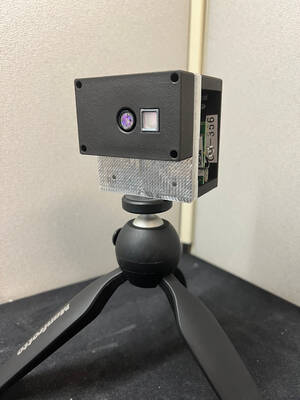
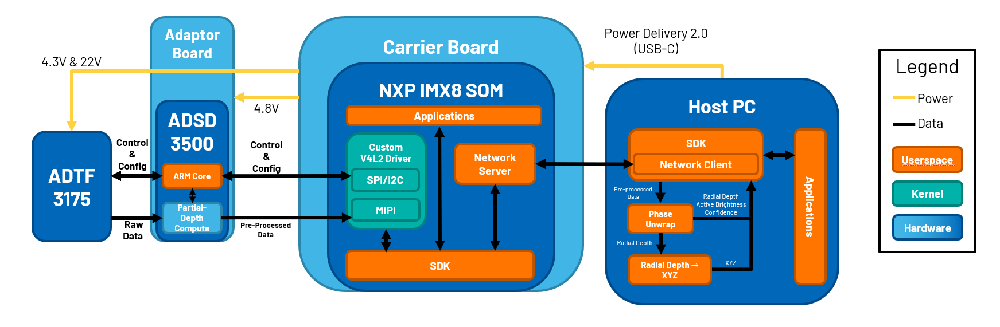
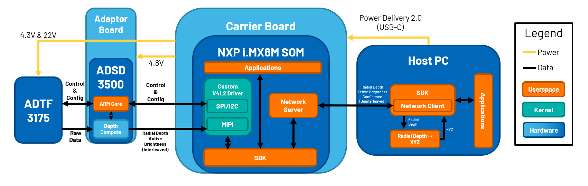

.. _EVAL-ADTF3175D-NXZ:

EVAL-ADTF3175D-NXZ
==================

.. toctree::
   :maxdepth: 2
   :caption: Contents:

Introduction
------------
The EVAL-ADTF3175D-NXZ time of flight (ToF) evaluation kit is showcasing the ADTF3175 module with ADI's depth ISP, the ADSD3500. The kit supports ethernet over USB connectivity to a PC for real-time visualization, capture and post processing of depth data. The kit includes host PC software (Windows) and an open source multi-platform SDK for custom application development.

+-----------------+--------------------------------------+
| Resolution      | 1024×1024 TOF sensor                 |
+-----------------+--------------------------------------+
| Illumination    | FOI 81°x81° - 940nm Lumentum VCSEL   |
+-----------------+--------------------------------------+
| Field of View   | 75°x75°                              |
+-----------------+--------------------------------------+
| Operating Range | 0.4 to 4m @ 15% reflectance (native) |
+-----------------+--------------------------------------+
| Depth Noise     | < 15mm                               |
+-----------------+--------------------------------------+
| Accuracy        | +/- 3mm depth error                  |
+-----------------+--------------------------------------+

Modes of Operation
------------------

Note, only kits with serials number starting with 'am' are supported.

For the ADTF3175D module the following modes of operation are supported:

+-----------------+--------------------------------------+
| Mode Number     | Description                          |
+=================+======================================+
| 0               | Short Range Native/MP/1024x1024      |
+-----------------+--------------------------------------+
| 1               | Long Range Native/MP/1024x1024       |
+-----------------+--------------------------------------+
| 2               | Short Range QNative/QMP/512x512      |
+-----------------+--------------------------------------+
| 3               | Long Range Qnative/QMP/512x512       |
+-----------------+--------------------------------------+

What is included in the kit?
----------------------------

- ADTF3175D Evaluation Module

  - ADTF3175 Module

  - i.MX8 M Plus SOM (SolidRun)

  - Camera Interface Board

  - ADSD3500 Interposer board

- 16GB flashed microSD card (Inserted in module SD card slot)

- USB-C to USB-C cable. Supports PD 2.0, and USB 3.1

- Tripod

System Overview
---------------

* :doc:`EVAL-ADTF3175D-NXZ-Block-Diagram`

Native/MP/1024x1024

Qnative/QMP/512x512

