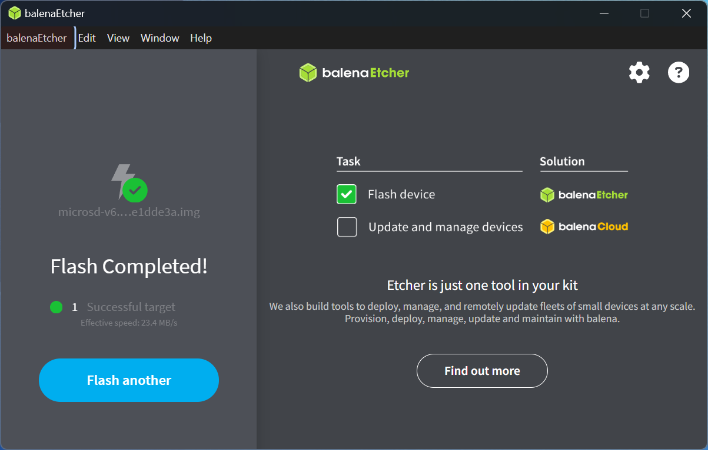
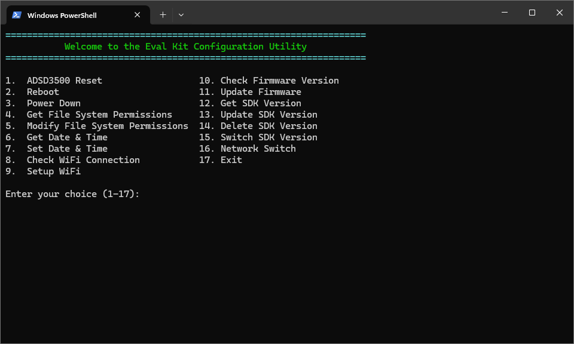

<span style="font-size:30px;"><u>ADTF3175D Eval Kit Release 6.1.0</u></span>

- [Release Notes](#release-notes)
- [🛑 Requirements 🛑](#-requirements-)
- [Dependencies](#dependencies)
- [Installation](#installation)
  - [1. Install on the Host](#1-install-on-the-host)
    - [Windows 11](#windows-11)
    - [Ubuntu 22.04 or Ubuntu 24.04](#ubuntu-2204-or-ubuntu-2404)
    - [Overview of Installed Files](#overview-of-installed-files)
  - [2. Flashing the SD Card Image](#2-flashing-the-sd-card-image)
    - [Do you need to update the SD card?](#do-you-need-to-update-the-sd-card)
    - [Windows 11, Ubuntu 22.04 or Ubuntu 24.04: Using Balena Etcher](#windows-11-ubuntu-2204-or-ubuntu-2404-using-balena-etcher)
    - [Windows 11: Using Win32 Disk Imager](#windows-11-using-win32-disk-imager)
  - [3. Updating the ADSD3500 ISP firmware.](#3-updating-the-adsd3500-isp-firmware)
- [Configuration of the Eval Kit from the Host](#configuration-of-the-eval-kit-from-the-host)
  - [PowerShell Interface](#powershell-interface)
    - [1. Reset ADSD3500](#1-reset-adsd3500)
    - [2. Reboot](#2-reboot)
    - [3. Power Down](#3-power-down)
    - [4. Get File System Permissions](#4-get-file-system-permissions)
    - [5. Modify File System Permissions](#5-modify-file-system-permissions)
    - [6. Get Date \& Time](#6-get-date--time)
    - [7. Set Date \& Time](#7-set-date--time)
    - [8. Check WiFi Connection](#8-check-wifi-connection)
    - [9. Setup WiFi](#9-setup-wifi)
    - [10. Check Firmware Version](#10-check-firmware-version)
    - [11. Update Firmware](#11-update-firmware)
    - [12. Get SDK Version](#12-get-sdk-version)
    - [13. Update SDK Version](#13-update-sdk-version)
    - [14. Switch SDK Version](#14-switch-sdk-version)
    - [15. Network Switch](#15-network-switch)
- [Using the Eval Kit](#using-the-eval-kit)
  - [C++ Tools](#c-tools)
    - [data\_collect (C++)](#data_collect-c)
      - [Command Line Interface](#command-line-interface)
      - [Example 1: Basic Usage](#example-1-basic-usage)
      - [Example 2: Saving Configuration Data to JSON](#example-2-saving-configuration-data-to-json)
      - [Example 3: Loading Configuration Data from JSON](#example-3-loading-configuration-data-from-json)
      - [Extracting Data from Saved Streams: rawparser.py](#extracting-data-from-saved-streams-rawparserpy)
        - [Command Line Interface](#command-line-interface-1)
        - [Example Usage](#example-usage)
    - [first\_frame (C++)](#first_frame-c)
      - [Command Line Interface](#command-line-interface-2)
      - [Example 1: Basic Usage](#example-1-basic-usage-1)
    - [ADIToFGUI (C++)](#aditofgui-c)
        - [Open ADTF3175D Eval Kit](#open-adtf3175d-eval-kit)
        - [Mode Selection](#mode-selection)
        - [Data Views](#data-views)
        - [ADIToFGUI and Configuration Parameters](#aditofgui-and-configuration-parameters)
  - [Python Tools](#python-tools)
    - [Setting for using the Python Bindings](#setting-for-using-the-python-bindings)
      - [Setup](#setup)
      - [Activate](#activate)
      - [Decativate](#decativate)
    - [data\_collect (Python)](#data_collect-python)
      - [Command Line Interface](#command-line-interface-3)
    - [first\_frame (Python)](#first_frame-python)
      - [Command Line Interface](#command-line-interface-4)
    - [streaming (Python)](#streaming-python)
      - [Command Line Interface](#command-line-interface-5)
      - [Example Usage](#example-usage-1)
    - [showPointCloud](#showpointcloud)
      - [Command Line Interface](#command-line-interface-6)
      - [Example Usage](#example-usage-2)
- [Appendix](#appendix)
  - [Configuration JSON File](#configuration-json-file)
    - [General Parameters](#general-parameters)
    - [Mode Parameters](#mode-parameters)


---
---

# Release Notes 

* IP address of device is now 192.168.56.1.
* Improved frame transfer performance:
    * ZeroMQ has replaced libwebsockets as the protocol stack between the device and the host for control and frame data.
    * Multi-threading is now used to enhance frame data transfer between V4L2 and the depth compute library.
* Update and configuration accessible via a web interface or a PowerShell script.
* Ubuntu 20.04 support has been removed, but Ubuntu 24.04 has been added alongside Ubuntu 22.04.
* Fixed an issue with displaying the point cloud.
* Update cJSON to the latest version.
* Dependency libraries are now statically link instead of dynamically linked to the libaditof SDK binary.
* Support for ADSD3500 ISP firmware version 6.0.0 API updates.
  
```
$ ssh analog@192.168.56.1
Username: analog
Password: analog
```

---
---

# 🛑 Requirements 🛑

**IMPORTANT**: The SD card image and the ADSD3500 firmware must be updated with the following.

* ADSD3500 firmware version 6.0.0
* SD Card Image 6.1.0

Please note, both of these items are available via the installation package in the *image* folder.

To update each the ADSD3500 firmware and SD card image see the following sections, respectively:

* [Flashing the SD Card Image](#2-flashing-the-sd-card-image)
* [Updating the ADSD3500 ISP firmware.](#3-updating-the-adsd3500-isp-firmware)
  
---
---
# Dependencies

* Host operating system: Windows 11, Ubuntu 22.04 or Ubuntu 24.04
* [Python 3.10](https://www.python.org/downloads/release/python-3100/)
* SD card flashing software: 
    * Windows 11, Ubuntu 22.04 or Ubuntu 24.04: [Balena Etcher](https://etcher.balena.io/#download-etcher)
    * Windows 11: [Win32 Disk Imager](https://sourceforge.net/projects/win32diskimager/)
* PowerShell:
    * Windows 11: A standard part of Windows 11
    * Ubuntu 22.04 or Ubuntu 24.04: [Installing PowerShell on Ubuntu](https://learn.microsoft.com/en-us/powershell/scripting/install/install-ubuntu?view=powershell-7.5)


---
---
# Installation 


1. Download the appropriate release of 6.1.0 from [ADI ToF Release Page on GitHub](https://github.com/analogdevicesinc/ToF/releases).
1. Follow the installation instructions from [ADI ToF Release Page on GitHub](https://github.com/analogdevicesinc/ToF/releases).

## 1. Install on the Host

### Windows 11
1. Run the downloaded installer: *TOF_Evaluation_ADTF3175D-Rel6.1.0.exe*.
   1. Accept the ELA when prompted.
   2. When prompted with **InstallShield Wizard Completed**, choose *Download image file*.
   * Notes
     * Unless changed by the user, the package installs to *c:\Analog Devices\TOF_Evaluation_ADTF3175D-Rel6.1.0* location.
     * If the image file was not downloaded via the installer it can still be download using *get_image.cmd*. *get_image.cmd* isis available at *TOF_Evaluation_ADTF3175D-Rel6.1.0\image\get_image.cmd*. This can be also used to re-download the image file.
1. Prepare for the next stages.
   1. Once download completed and zip file will be available at the same location.
   2. Unzip the downloaded file, *NXP-Img-Rel6.1.0-ADTF3175D-xxxxxxxx.zip* file. This can be done from the context menu of explorer. Or using PowerShell.
   * Notes:
     * The created folder contains the NXP image, depth compute library installer, and ADSD3500 firmware binary.

### Ubuntu 22.04 or Ubuntu 24.04

1. Make the downloaded file executable: *chmod +x ToF_Evaluation_Ubuntu_ADTF3175D-Rel6.1.0.sh*.
2. Run the downloaded installer: *./ToF_Evaluation_Ubuntu_ADTF3175D-Rel6.1.0.sh*.
   1. Accept the ELA when prompted.
   * Notes
     * ToF_Evaluation_Ubuntu_ADTF3175D-Rel6.1.0 will be installed to *~/Analog Devices/ToF_Evaluation_Ubuntu_ADTF3175D-Rel6.1.0*.
     * There are two bin folders *bin_22.04* and *bin_24.04*. Use the appropriate version for your Ubuntu Desktop AMD x64.
1. Download the image file.
   1. *cd ~/Analog\ Devices/ToF_Evaluation_Ubuntu_ADTF3175D-Rel6.1.0/image*.
   2. *source ./get_image.sh*.
2. Prepare for the next stages.
   1.  Unzip downloaded image file
       1. *sudo apt install unzip*
       2. *unzip NXP-Img-Rel6.1.0-ADTF3175D-xxxxxxxx.zip -f NXP-Img-Rel6.1.0-ADTF3175D-xxxxxxxx*
       * Notes: 
         * This folder contains the NXP image, depth compute library installer, and ADSD3500 firmware binary.

### Overview of Installed Files

TODO

## 2. Flashing the SD Card Image

The following requires *microsd-6.0.0-13dd25d8.zip* in the *image/NXP-Img-Rel6.1.0-ADTF3175D-xxxxxxxx* folder. This was extracted in the previous step.


### Do you need to update the SD card?

Username: analog
Password: analog

```bash
$ ssh analog@192.168.56.1 "cat /boot/sw-versions | grep sd_img_ver"
analog@192.168.56.1's password:
sd_img_ver      microsd-v6.1.0-ace65e91.img
```

Where *sd_img_ver* indicates the image on the SD card. As of writing, if you are running with v6.1.0 already there is no need to update the SD card.

### Windows 11, Ubuntu 22.04 or Ubuntu 24.04: Using Balena Etcher

Note, the following images were taken from Windows, but you will see the same fundamental information on Ubuntu.

Step 1. Select the image file, the destination folder, then **Flash!**.

[](images/balena-etcher-1.png)

Step 2. Write is complete and successful.

[](images/balena-etcher-2.png)

Trouble Shooting:
* On Windows: If you get an error after clicking **Write**, try rebooting your computer and restarting the process.

### Windows 11: Using Win32 Disk Imager

In the case of Win32 Disk Imager, it is necessary to unzip *microsd-6.0.0-13dd25d8.zip* to get the *.img* file contained within.

Step 1. Select the image file, the destination folder, then **Write**.

[](images/win32-disk-imager-1.png)

Step 2. Write is complete and successful.

[](images/win32-disk-imager-2.png)

Trouble Shooting:
* On Windows: If you get an error after clicking **Write**, try rebooting your computer and restarting the process.

## 3. Updating the ADSD3500 ISP firmware.

Note: This method has changed to use the new PowerShell interface.

---
---
# Configuration of the Eval Kit from the Host

## PowerShell Interface

To configure the device we have provided a new interface via PowerShell. Through the configuration interface the user can:
1.  ADSD3500 Reset                  
2.  Reboot                          
3.  Power Down                      
4.  Get File System Permissions     
5.  Modify File System Permissions  
6.  Get Date & Time                 
7.  Set Date & Time                 
8.  Check WiFi Connection
9.  Setup WiFi
10. Check Firmware Version
11. Update Firmware
12. Get SDK Version
13. Update SDK Version
14. Switch SDK Version
15. Network Switch
16. Exit

PowerShell is natively a part of Windows 11, and it is also available on Linux, see [Installing PowerShell on Ubuntu](https://learn.microsoft.com/en-us/powershell/scripting/install/install-ubuntu?view=powershell-7.5).

The configuration scripts are available in the *config* folder in the installed folder.

```
cd config
Unblock-File -Path *
Evalkit_Config_Utility.ps1
```
[](images/config-1.png)

### 1. Reset ADSD3500

This command resets the ADSD3500 ISP. It is generally not needed, but is available if needed.

```
Resetting ADSD3500...

Reset Done.
```

### 2. Reboot

As implied, this command reboots the ADTF3175D Eval Kit. The reboot command is sent to the eval kit, but it will take approximately 45 seconds for the eval it to reboot. 

```
Rebooting system...

Reboot initiated successfully.
```

Pinging the eval kit will show when it is alive again: *ping 192.168.56.1*.
```
$ ping 192.168.56.1

Pinging 192.168.56.1 with 32 bytes of data:
Reply from 192.168.56.1: bytes=32 time=6ms TTL=64
Reply from 192.168.56.1: bytes=32 time=4ms TTL=64
Reply from 192.168.56.1: bytes=32 time=3ms TTL=64
Reply from 192.168.56.1: bytes=32 time=3ms TTL=64

Ping statistics for 192.168.56.1:
    Packets: Sent = 4, Received = 4, Lost = 0 (0% loss),
Approximate round trip times in milli-seconds:
    Minimum = 3ms, Maximum = 6ms, Average = 4ms
```

### 3. Power Down

This command will power down the eval kit. The USB cable will need to be unplugged and re-plugged to power the device up again.

Command output:
```
Powering Down system..
```

### 4. Get File System Permissions

Checks the state of the Linux file system. 

If the file system is read-only this will be the following output.
```
Checking Permission...


Permission is : RO
```

If the file system is read-write this will be the following output.
```
Checking Permission...


Permission is : RW
```

### 5. Modify File System Permissions

This changes the Linux file system write permissions. If it is read-only, it will be changed to read-write. If it is read-write, it will change to read-only.

Case 1. Read-only to read-write
```
Modifying Permission...
Warning : This process will reboot the system.


Change Permission from RO to RW


Reboot initiated successfully.
```

Case 2. Read-write to read-only
```
Modifying Permission...
Warning : This process will reboot the system.


Change Permission from RW to RO


Reboot initiated successfully.
```

### 6. Get Date & Time

This command will report the date and time of the eval kit in the context of the local time zone.

```
Getting Date & Time...

Server Time (Local): 07/30/2025 10:57:24
```

### 7. Set Date & Time

This command will sync the date and time of the eval kit with that of the current PC in the context of the local time zone.

```
Setting Date & Time...

Server time and time zone updated successfully
```

### 8. Check WiFi Connection

This command checks the state of the WiFi connection.

Case 1. No WiFi Connection
```
Checking WiFi Connection...

Disconnected
```

Case 2. WiFi Connected
```
Checking WiFi Connection...

Connected
```

### 9. Setup WiFi

This command should be used to setup the WiFi connection of the device.

Note: the device needs to be in read write mode. Use the command **Modify File System Permissions** to set the device to read write mode if needed.

```
Setting up Wifi ...

Note : This Setup requires RW access.

Warning : This Process Will Reboot the system.

SSID: IamHereWiFi

password: **********

WiFi setup successful. System is Rebooting.
```

### 10. Check Firmware Version

Report the firmware version for the ADSD3500 ISP.

```
Checking Firmware version...

Current Firmware Version: 6.0.0
```

### 11. Update Firmware

Update the ADSD3500 firmware.

```
TODO
```

### 12. Get SDK Version

Reports back the current SDK version used on the ADTF3175D Eval Kit.

```
Getting SDK Version..
6.1.0
```

### 13. Update SDK Version

```
TODO
```

### 14. Switch SDK Version

```
TODO
```

### 15. Network Switch

This must be only used for Linux systems. It enables the user to switch the USB network mode between RNDIS and ECM. 

RNDIS is the default mode - which supports Linux and Windows. However, RNDIS has poor performance in Linux.

For Linux it is recommended the user switch to ECM mode.

```
Switching Network...
Network mode value: ubuntu

Warning : This Process Will Reboot the system.
```

The next stage is critical. Note, unplugging re-plugging the device may require the following to be done again.

For example, where the device name in this case is **enx3e35aecf0ede**. The before and after MTU sizes are **1500** and **15000** respectively.

```
$ ip a
22: enx3e35aecf0ede: <BROADCAST,MULTICAST,UP,LOWER_UP> mtu 1500 qdisc fq_codel state UNKNOWN group default qlen 1000
    link/ether 3e:35:ae:cf:0e:de brd ff:ff:ff:ff:ff:ff
    inet 192.168.56.101/24 brd 192.168.56.255 scope global dynamic noprefixroute enx3e35aecf0ede
       valid_lft 3349sec preferred_lft 3349sec
    inet6 fe80::a657:5ddd:a219:2e0e/64 scope link noprefixroute 
       valid_lft forever preferred_lft forever

$ sudo ip link set dev enx3e35aecf0ede mtu 15000

$ ip a
22: enx3e35aecf0ede: <BROADCAST,MULTICAST,UP,LOWER_UP> mtu 15000 qdisc fq_codel state UNKNOWN group default qlen 1000
    link/ether 3e:35:ae:cf:0e:de brd ff:ff:ff:ff:ff:ff
    inet 192.168.56.101/24 brd 192.168.56.255 scope global dynamic noprefixroute enx3e35aecf0ede
       valid_lft 3132sec preferred_lft 3132sec
    inet6 fe80::a657:5ddd:a219:2e0e/64 scope link noprefixroute 
       valid_lft forever preferred_lft forever
```


---
---
# Using the Eval Kit

Note, each tool below is supported on Windows 11, Ubuntu 22.04 and Ubuntu 24.04.

## C++ Tools

### data_collect (C++)

**data_collect** is use save a stream of frames to the file system of the host computer. 

#### Command Line Interface
```
$ data_collect -h
Usage: data_collect [options]
    Data Collect.
    Usage:
      data_collect 
      data_collect [--f <folder>] [--n <ncapture>] [--m <mode>] [--wt <warmup>] [--ccb FILE] [--ip <ip>] [--fw <firmware>] [-s | --split] [-t | --netlinktest] [--ic <imager-configuration>] [-scf <save-configuration-file>] [-lcf <load-configuration-file>]
      data_collect (-h | --help)

    Options:
      -h --help          Show this screen.
      --f <folder>       Output folder (max name 512) [default: ./]
      --n <ncapture>     Capture frame num. [default: 1]
      --m <mode>         Mode to capture data in. [default: 0]
      --wt <warmup>      Warmup Time (sec) [default: 0]
      --ccb <FILE>       The path to store CCB content
      --ip <ip>          Camera IP
      --fw <firmware>    Adsd3500 fw file
      --split            Save each frame into a separate file (Debug)
      --netlinktest      Puts server on target in test mode (Debug)
      --singlethread     Store the frame to file using same tread
      --ic <imager-configuration>   Select imager configuration: standard, standard-raw,
                         custom, custom-raw. By default is standard.
      --scf <save-configuration-file>    Save current configuration to json file
      --lcf <load-configuration-file>    Load configuration from json file

    Note: --m argument supports index (0, 1, etc.) 

    Valid mode (--m) options are:
        0: short-range native
        1: long-range native
        2: short-range Qnative
        3: long-range Qnative
        4: pcm-native
        5: long-range mixed
        6: short-range mixed
```

#### Example 1: Basic Usage
* *--f output*: Place captured data into the folder *output*.
* *--m 1*: Use mode 1.
* *--n 100*: Capture 100 frames.
* *--ip 192.168.56.1*: Access the camera on the IP address 192.168.56.1.
```
$ data_collect --f output --m 1 --n 100 --ip 192.168.56.1
I20250709 15:20:25.556339 28592 main.cpp:169] SDK version: 6.1.0 | branch:  | commit:
I20250709 15:20:25.571966 28592 main.cpp:285] Output folder: output
I20250709 15:20:25.571966 28592 main.cpp:286] Mode: 1
I20250709 15:20:25.571966 28592 main.cpp:287] Number of frames: 100
I20250709 15:20:25.571966 28592 main.cpp:288] Json file:
I20250709 15:20:25.571966 28592 main.cpp:289] Warm Up Time is: 0 seconds
I20250709 15:20:25.571966 28592 main.cpp:290] Configuration is: standard
I20250709 15:20:25.571966 28592 main.cpp:293] Ip address is: 192.168.56.1
WARNING: Logging before InitGoogleLogging() is written to STDERR
I20250709 15:20:25.571966 28592 system_impl.cpp:91] SDK built with zmq version:4.3.6
I20250709 15:20:25.571966 28592 network_sensor_enumerator.cpp:66] Looking for sensors over network: 192.168.56.1
I20250709 15:20:25.635282 28592 network.cpp:215] Attempting to connect server...
I20250709 15:20:25.635282 50912 network.cpp:501] Event: CONNECT_DELAYED - Connection attempt delayed, server might be unavailable.
I20250709 15:20:25.635282 50912 network.cpp:461] Connected to server
Conn established
I20250709 15:20:25.793783 28592 camera_itof.cpp:105] Sensor name = adsd3500
I20250709 15:20:25.793783 28592 camera_itof.cpp:125] Initializing camera
I20250709 15:20:25.809423 28592 network.cpp:215] Attempting to connect server...
I20250709 15:20:25.809423 50256 network.cpp:501] Event: CONNECT_DELAYED - Connection attempt delayed, server might be unavailable.
I20250709 15:20:25.809423 50256 network.cpp:461] Connected to server
Conn established
I20250709 15:20:26.063987 28592 camera_itof.cpp:222] Current adsd3500 firmware version is: 6.0.0.0
I20250709 15:20:26.063987 28592 camera_itof.cpp:224] Current adsd3500 firmware git hash is: 66d74765d8339ab89f3085eba04a1b077b1a6faa
W20250709 15:20:26.112510 28592 camera_itof.cpp:252] fsyncMode is not being set by SDK.
W20250709 15:20:26.112510 28592 camera_itof.cpp:262] mipiSpeed is not being set by SDK.
W20250709 15:20:26.112510 28592 camera_itof.cpp:273] enableTempCompenstation is not being set by SDK.
W20250709 15:20:26.112510 28592 camera_itof.cpp:283] enableEdgeConfidence is not being set by SDK.
I20250709 15:20:26.127589 28592 camera_itof.cpp:289] Module serial number: Crosby_DV3_2_07D
I20250709 15:20:26.127589 28592 camera_itof.cpp:297] Camera initialized
I20250709 15:20:26.127589 28592 main.cpp:334] Configure camera with standard
I20250709 15:20:26.127589 28592 main.cpp:351] SD card image version: microsd-v6.1.0-ace65e91.img
I20250709 15:20:26.127589 28592 main.cpp:352] Kernel version: lf-5.10.72-2.2.0
I20250709 15:20:26.127589 28592 main.cpp:353] U-Boot version: imx_v2020.04_5.4.70_2.3.0
I20250709 15:20:26.426385 28592 camera_itof.cpp:1812] Camera FPS set from parameter list at: 10
W20250709 15:20:26.426385 28592 camera_itof.cpp:2032] vcselDelay was not found in parameter list, not setting.
W20250709 15:20:26.442023 28592 camera_itof.cpp:2084] enablePhaseInvalidation was not found in parameter list, not setting.
I20250709 15:20:26.473274 28592 camera_itof.cpp:379] Using the following configuration parameters for mode 1
I20250709 15:20:26.473274 28592 camera_itof.cpp:382] abThreshMin : 3.0
I20250709 15:20:26.473274 28592 camera_itof.cpp:382] bitsInAB : 16
I20250709 15:20:26.473274 28592 camera_itof.cpp:382] bitsInConf : 0
I20250709 15:20:26.473274 28592 camera_itof.cpp:382] bitsInPhaseOrDepth : 12
I20250709 15:20:26.473274 28592 camera_itof.cpp:382] confThresh : 25.0
I20250709 15:20:26.473274 28592 camera_itof.cpp:382] depthComputeIspEnable : 1
I20250709 15:20:26.473274 28592 camera_itof.cpp:382] fps : 10
I20250709 15:20:26.473274 28592 camera_itof.cpp:382] headerSize : 128
I20250709 15:20:26.473274 28592 camera_itof.cpp:382] inputFormat : mipiRaw12_8
I20250709 15:20:26.473274 28592 camera_itof.cpp:382] interleavingEnable : 0
I20250709 15:20:26.473274 28592 camera_itof.cpp:382] jblfABThreshold : 10.0
I20250709 15:20:26.473274 28592 camera_itof.cpp:382] jblfApplyFlag : 1
I20250709 15:20:26.473274 28592 camera_itof.cpp:382] jblfExponentialTerm : 5.0
I20250709 15:20:26.473274 28592 camera_itof.cpp:382] jblfGaussianSigma : 10.0
I20250709 15:20:26.473274 28592 camera_itof.cpp:382] jblfMaxEdge : 12.0
I20250709 15:20:26.473274 28592 camera_itof.cpp:382] jblfWindowSize : 7
I20250709 15:20:26.473274 28592 camera_itof.cpp:382] multiCoreEnable : 1
I20250709 15:20:26.473274 28592 camera_itof.cpp:382] numCores : 4
I20250709 15:20:26.473274 28592 camera_itof.cpp:382] partialDepthEnable : 1
I20250709 15:20:26.473274 28592 camera_itof.cpp:382] phaseInvalid : 0
I20250709 15:20:26.473274 28592 camera_itof.cpp:382] radialThreshMax : 4200.0
I20250709 15:20:26.473274 28592 camera_itof.cpp:382] radialThreshMin : 30.0
I20250709 15:20:26.473274 28592 camera_itof.cpp:382] xyzEnable : 1
I20250709 15:20:26.473274 28592 camera_itof.cpp:392] Metadata in AB is enabled and it is stored in the first 128 bytes.
I20250709 15:20:27.888085 28592 camera_itof.cpp:483] Using closed source depth compute library.
I20250709 15:20:28.512868 28592 network.cpp:619] Frame Client Connection established.
I20250709 15:20:28.658123 28592 camera_itof.cpp:615] Dropped first frame
I20250709 15:20:28.734925 28592 main.cpp:462] Requesting 100 frames!
I20250709 15:20:38.771598 28592 main.cpp:487] Measured FPS: 9.96419
I20250709 15:20:38.771598 28592 network_depth_sensor.cpp:391] Stopping device
I20250709 15:20:38.832966 28592 network.cpp:604] Frame socket connection closed.

$ dir output
 Volume in drive C is OSDisk
 Volume Serial Number is B258-6604

 Directory of ...\output

07/09/2025  03:20 PM    <DIR>          .
07/09/2025  03:20 PM    <DIR>          ..
07/09/2025  03:20 PM     1,048,588,800 frame2025_07_09_15_20_28_0.bin
               1 File(s)  1,048,588,800 bytes
               2 Dir(s)  14,942,445,568 bytes free
```

#### Example 2: Saving Configuration Data to JSON
* *--scf saved_cfg.json*: Save the device configuration file to *saved_cfg.json*.
* *--ip 192.168.56.1*: Access the camera on the IP address 192.168.56.1.
```
$ data_collect --scf saved_cfg.json --ip 192.168.56.1
I20250709 15:22:09.820384 18952 main.cpp:169] SDK version: 6.1.0 | branch:  | commit:
I20250709 15:22:09.820384 18952 main.cpp:285] Output folder: .
I20250709 15:22:09.820384 18952 main.cpp:286] Mode: 0
I20250709 15:22:09.820384 18952 main.cpp:287] Number of frames: 0
I20250709 15:22:09.820384 18952 main.cpp:288] Json file:
I20250709 15:22:09.820384 18952 main.cpp:289] Warm Up Time is: 0 seconds
I20250709 15:22:09.820384 18952 main.cpp:290] Configuration is: standard
I20250709 15:22:09.820384 18952 main.cpp:293] Ip address is: 192.168.56.1
WARNING: Logging before InitGoogleLogging() is written to STDERR
I20250709 15:22:09.820384 18952 system_impl.cpp:91] SDK built with zmq version:4.3.6
I20250709 15:22:09.820384 18952 network_sensor_enumerator.cpp:66] Looking for sensors over network: 192.168.56.1
I20250709 15:22:09.883611 18952 network.cpp:215] Attempting to connect server...
I20250709 15:22:09.883611 50976 network.cpp:501] Event: CONNECT_DELAYED - Connection attempt delayed, server might be unavailable.
I20250709 15:22:09.883611 50976 network.cpp:461] Connected to server
Conn established
Assertion failed: Socket operation on non-socket [10038] (C:\dev\ToF\sources\eval-kit\SoMv1\dev\main\libaditof\libzmq\src\signaler.cpp:345)
I20250709 15:22:10.047490 18952 camera_itof.cpp:105] Sensor name = adsd3500
I20250709 15:22:10.047490 18952 camera_itof.cpp:125] Initializing camera
I20250709 15:22:10.088671 18952 network.cpp:215] Attempting to connect server...
I20250709 15:22:10.088671 39032 network.cpp:501] Event: CONNECT_DELAYED - Connection attempt delayed, server might be unavailable.
I20250709 15:22:10.088671 39032 network.cpp:461] Connected to server
Conn established
I20250709 15:22:10.343323 18952 camera_itof.cpp:222] Current adsd3500 firmware version is: 6.0.0.0
I20250709 15:22:10.343323 18952 camera_itof.cpp:224] Current adsd3500 firmware git hash is: 66d74765d8339ab89f3085eba04a1b077b1a6faa
W20250709 15:22:10.389600 18952 camera_itof.cpp:252] fsyncMode is not being set by SDK.
W20250709 15:22:10.389600 18952 camera_itof.cpp:262] mipiSpeed is not being set by SDK.
W20250709 15:22:10.389600 18952 camera_itof.cpp:273] enableTempCompenstation is not being set by SDK.
W20250709 15:22:10.389600 18952 camera_itof.cpp:283] enableEdgeConfidence is not being set by SDK.
I20250709 15:22:10.389600 18952 camera_itof.cpp:289] Module serial number: Crosby_DV3_2_07D
I20250709 15:22:10.389600 18952 camera_itof.cpp:297] Camera initialized
I20250709 15:22:10.405228 18952 main.cpp:334] Configure camera with standard
I20250709 15:22:10.406365 18952 main.cpp:343] Current configuration info saved to file saved_cfg.json
I20250709 15:22:10.406365 18952 main.cpp:351] SD card image version: microsd-v6.1.0-ace65e91.img
I20250709 15:22:10.406365 18952 main.cpp:352] Kernel version: lf-5.10.72-2.2.0
I20250709 15:22:10.406365 18952 main.cpp:353] U-Boot version: imx_v2020.04_5.4.70_2.3.0
I20250709 15:22:15.641728 18952 camera_itof.cpp:1812] Camera FPS set from parameter list at: 10
W20250709 15:22:15.641728 18952 camera_itof.cpp:2032] vcselDelay was not found in parameter list, not setting.

$ dir
 Volume in drive C is OSDisk
 Volume Serial Number is B258-6604

 Directory of .

07/09/2025  03:22 PM    <DIR>          .
07/09/2025  03:22 PM    <DIR>          ..
07/09/2025  12:54 PM         1,644,544 aditof.dll
07/09/2025  12:54 PM           174,592 data_collect.exe
07/09/2025  03:22 PM             4,047 saved_cfg.json
               3 File(s)      1,823,183 bytes
               2 Dir(s)  15,991,197,696 bytes free
```

#### Example 3: Loading Configuration Data from JSON

In this example we will use the JSON file to change the frame rate for mode 3 to 5fps.

[](images/data_collect_example_3_fps_change.png)

* *--f output*: Place captured data into the folder *output*.
* *--m 1*: Use mode 1.
* *--n 100*: Capture 100 frames.
* *--lcf saved_cfg.json*: Used the device configuration file *saved_cfg.json*.
* *--ip 192.168.56.1*: Access the camera on the IP address 192.168.56.1.
```
$ data_collect --f output --m 1 --n 100 --lcf saved_cfg.json --ip 192.168.56.1
I20250709 15:27:06.928929 24096 main.cpp:169] SDK version: 6.1.0 | branch:  | commit:
I20250709 15:27:06.928929 24096 main.cpp:285] Output folder: output
I20250709 15:27:06.928929 24096 main.cpp:286] Mode: 1
I20250709 15:27:06.928929 24096 main.cpp:287] Number of frames: 100
I20250709 15:27:06.928929 24096 main.cpp:288] Json file: saved_cfg.json
I20250709 15:27:06.928929 24096 main.cpp:289] Warm Up Time is: 0 seconds
I20250709 15:27:06.928929 24096 main.cpp:290] Configuration is: standard
I20250709 15:27:06.928929 24096 main.cpp:293] Ip address is: 192.168.56.1
WARNING: Logging before InitGoogleLogging() is written to STDERR
I20250709 15:27:06.928929 24096 system_impl.cpp:91] SDK built with zmq version:4.3.6
I20250709 15:27:06.928929 24096 network_sensor_enumerator.cpp:66] Looking for sensors over network: 192.168.56.1
I20250709 15:27:06.975823 24096 network.cpp:215] Attempting to connect server...
I20250709 15:27:06.975823 51092 network.cpp:501] Event: CONNECT_DELAYED - Connection attempt delayed, server might be unavailable.
I20250709 15:27:06.978331 51092 network.cpp:461] Connected to server
Conn established
I20250709 15:27:07.148248 24096 camera_itof.cpp:105] Sensor name = adsd3500
I20250709 15:27:07.148248 24096 camera_itof.cpp:125] Initializing camera
I20250709 15:27:07.166107 24096 network.cpp:215] Attempting to connect server...
I20250709 15:27:07.166107 43256 network.cpp:501] Event: CONNECT_DELAYED - Connection attempt delayed, server might be unavailable.
I20250709 15:27:07.166107 43256 network.cpp:461] Connected to server
Conn established
I20250709 15:27:07.457262 24096 camera_itof.cpp:222] Current adsd3500 firmware version is: 6.0.0.0
I20250709 15:27:07.458998 24096 camera_itof.cpp:224] Current adsd3500 firmware git hash is: 66d74765d8339ab89f3085eba04a1b077b1a6faa
W20250709 15:27:07.479894 24096 camera_itof.cpp:252] fsyncMode is not being set by SDK.
W20250709 15:27:07.479894 24096 camera_itof.cpp:262] mipiSpeed is not being set by SDK.
W20250709 15:27:07.479894 24096 camera_itof.cpp:273] enableTempCompenstation is not being set by SDK.
W20250709 15:27:07.479894 24096 camera_itof.cpp:283] enableEdgeConfidence is not being set by SDK.
I20250709 15:27:07.479894 24096 camera_itof.cpp:289] Module serial number: Crosby_DV3_2_07D
I20250709 15:27:07.479894 24096 camera_itof.cpp:297] Camera initialized
I20250709 15:27:07.496006 24096 main.cpp:334] Configure camera with standard
I20250709 15:27:07.496006 24096 main.cpp:351] SD card image version: microsd-v6.1.0-ace65e91.img
I20250709 15:27:07.496006 24096 main.cpp:352] Kernel version: lf-5.10.72-2.2.0
I20250709 15:27:07.496006 24096 main.cpp:353] U-Boot version: imx_v2020.04_5.4.70_2.3.0
I20250709 15:27:07.763384 24096 camera_itof.cpp:1812] Camera FPS set from parameter list at: 5
W20250709 15:27:07.763384 24096 camera_itof.cpp:2032] vcselDelay was not found in parameter list, not setting.
W20250709 15:27:07.778898 24096 camera_itof.cpp:2084] enablePhaseInvalidation was not found in parameter list, not setting.
I20250709 15:27:07.801113 24096 camera_itof.cpp:379] Using the following configuration parameters for mode 1
I20250709 15:27:07.806582 24096 camera_itof.cpp:382] abThreshMin : 3
I20250709 15:27:07.807090 24096 camera_itof.cpp:382] bitsInAB : 16
I20250709 15:27:07.807090 24096 camera_itof.cpp:382] bitsInConf : 0
I20250709 15:27:07.807090 24096 camera_itof.cpp:382] bitsInPhaseOrDepth : 12
I20250709 15:27:07.807090 24096 camera_itof.cpp:382] confThresh : 25
I20250709 15:27:07.807090 24096 camera_itof.cpp:382] depthComputeIspEnable : 1
I20250709 15:27:07.807090 24096 camera_itof.cpp:382] fps : 5
I20250709 15:27:07.807090 24096 camera_itof.cpp:382] headerSize : 128
I20250709 15:27:07.807090 24096 camera_itof.cpp:382] inputFormat : mipiRaw12_8
I20250709 15:27:07.807090 24096 camera_itof.cpp:382] interleavingEnable : 0
I20250709 15:27:07.807090 24096 camera_itof.cpp:382] jblfABThreshold : 10
I20250709 15:27:07.807090 24096 camera_itof.cpp:382] jblfApplyFlag : 1
I20250709 15:27:07.807090 24096 camera_itof.cpp:382] jblfExponentialTerm : 5
I20250709 15:27:07.807090 24096 camera_itof.cpp:382] jblfGaussianSigma : 10
I20250709 15:27:07.807090 24096 camera_itof.cpp:382] jblfMaxEdge : 12
I20250709 15:27:07.807090 24096 camera_itof.cpp:382] jblfWindowSize : 7
I20250709 15:27:07.807090 24096 camera_itof.cpp:382] multiCoreEnable : 1
I20250709 15:27:07.807090 24096 camera_itof.cpp:382] numCores : 4
I20250709 15:27:07.807090 24096 camera_itof.cpp:382] partialDepthEnable : 1
I20250709 15:27:07.807090 24096 camera_itof.cpp:382] phaseInvalid : 0
I20250709 15:27:07.807090 24096 camera_itof.cpp:382] radialThreshMax : 4200
I20250709 15:27:07.807090 24096 camera_itof.cpp:382] radialThreshMin : 30
I20250709 15:27:07.807090 24096 camera_itof.cpp:382] xyzEnable : 1
I20250709 15:27:07.811530 24096 camera_itof.cpp:392] Metadata in AB is enabled and it is stored in the first 128 bytes.
I20250709 15:27:09.213614 24096 camera_itof.cpp:483] Using closed source depth compute library.
I20250709 15:27:09.809082 24096 network.cpp:619] Frame Client Connection established.
I20250709 15:27:09.989188 24096 camera_itof.cpp:615] Dropped first frame
I20250709 15:27:10.179111 24096 main.cpp:462] Requesting 100 frames!
I20250709 15:27:30.129359 24096 main.cpp:487] Measured FPS: 5.01556
I20250709 15:27:30.129359 24096 network_depth_sensor.cpp:391] Stopping device
I20250709 15:27:30.255499 24096 network.cpp:604] Frame socket connection closed.
```
Notice, in the 3rd last line (*Measured FPS: 5.01556*), the frame rate is 5fps.

#### Extracting Data from Saved Streams: rawparser.py

*rawparser.py* is used to extract frames from data streams collected by data_collect. It can also be used to do the same for data streams recorded by ADIToFGUI. As with the Pyton bindings, Python 3.10 is required.

##### Command Line Interface
```
python rawparser.py -h
usage: rawparser.py [-h] [-o OUTDIR] [-n] [-f FRAMES] filename

Script to parse a raw file and extract different frame data

positional arguments:
  filename              bin filename to parse

options:
  -h, --help            show this help message and exit
  -o OUTDIR, --outdir OUTDIR
                        Output directory (optional)
  -n, --no_xyz          Input file doesn't have XYZ data
  -f FRAMES, --frames FRAMES
                        Frame range: N (just N), N- (from N to end), N-M (N to M inclusive)
```

##### Example Usage

The following example extarcts frames 10 thru 10 from the capture file *output\frame2025_07_09_15_27_10_0.bin* and places the contents in the folder *output\range_10_16*.

```
$ python rawparser.py output\frame2025_07_09_15_27_10_0.bin --outdir output\range_10_16 -f 10-16
rawparser 1.1.0
filename: output\frame2025_07_09_15_27_10_0.bin
The directory C:\tmp\output\range_10_16 was created.
Width x Height: 1024px x 1024px
Bits in depth: 2
Bits in AB: 2
Bits in conf: 0
File size: 1048588800
Frame size: 10485888
Relative Frame Range: 0 to 99
Processing frame #: 16

$ dir output\range_10_16\
 Volume in drive C is OSDisk
 Volume Serial Number is B258-6604

 Directory of C:\tmp\output\range_10_16

07/11/2025  03:09 PM    <DIR>          .
07/11/2025  03:09 PM    <DIR>          ..
07/11/2025  03:09 PM    <DIR>          frame2025_07_09_15_27_10_0_10
07/11/2025  03:09 PM    <DIR>          frame2025_07_09_15_27_10_0_11
07/11/2025  03:09 PM    <DIR>          frame2025_07_09_15_27_10_0_12
07/11/2025  03:09 PM    <DIR>          frame2025_07_09_15_27_10_0_13
07/11/2025  03:09 PM    <DIR>          frame2025_07_09_15_27_10_0_14
07/11/2025  03:09 PM    <DIR>          frame2025_07_09_15_27_10_0_15
07/11/2025  03:09 PM    <DIR>          frame2025_07_09_15_27_10_0_16
07/11/2025  03:09 PM    <DIR>          vid_frame2025_07_09_15_27_10_0
               0 File(s)              0 bytes
              10 Dir(s)  648,952,090,624 bytes free

$ dir output\range_10_16\frame2025_07_09_15_27_10_0_10
 Volume in drive C is OSDisk
 Volume Serial Number is B258-6604

 Directory of C:\tmp\output\range_10_16\frame2025_07_09_15_27_10_0_10

07/11/2025  03:09 PM    <DIR>          .
07/11/2025  03:09 PM    <DIR>          ..
07/11/2025  03:09 PM           425,239 ab_frame2025_07_09_15_27_10_0_10.png
07/11/2025  03:09 PM           235,164 depth_frame2025_07_09_15_27_10_0_10.png
07/11/2025  03:09 PM        10,485,888 frame2025_07_09_15_27_10_0_10.bin
07/11/2025  03:09 PM               381 metadata_frame2025_07_09_15_27_10_0_10.txt
07/11/2025  03:09 PM        25,165,974 pointcloud_frame2025_07_09_15_27_10_0_10.ply
               5 File(s)     36,312,646 bytes
               2 Dir(s)  648,951,046,144 bytes free
```

Each frame and its contents are extracted to its own folders:
```
C:\TMP\OUTPUT\RANGE_10_16
├───frame2025_07_09_15_27_10_0_10
├───frame2025_07_09_15_27_10_0_11
├───frame2025_07_09_15_27_10_0_12
├───frame2025_07_09_15_27_10_0_13
├───frame2025_07_09_15_27_10_0_14
├───frame2025_07_09_15_27_10_0_15
├───frame2025_07_09_15_27_10_0_16
└───vid_frame2025_07_09_15_27_10_0
```

Let's discuss *vid_frame2025_07_09_15_27_10_0* first. This contains an MP4 which represents a video of the captured frames, showing the depth and AB stream.

Let's take a look at the other generated frame data, we will consider the output in the folder *frame2025_07_09_15_27_10_0_10*. The following files are in the folder:

* **frame2025_07_09_15_27_10_0_10.bin**: This is frame #10 exracted from the recorded stream.
* **ab_frame2025_07_09_15_27_10_0_10.png**: PNG of the AB frame for frame #10.
* **depth_frame2025_07_09_15_27_10_0_10.png**: PNG of the depth frame for frame #10.
* **metadata_frame2025_07_09_15_27_10_0_10.txt**: Text file of metadata for frame #10.
* **pointcloud_frame2025_07_09_15_27_10_0_10.ply**: Point cloud file, in ply format, for frame #10.


### first_frame (C++)

#### Command Line Interface
```
$ first-frame.exe -h
First-frame usage:
    first-frame
    first-frame (-h | --help)
    first-frame [-ip | --ip <ip>] [-m | --m <mode>] [-config | --config <config_file.json>]

    Arguments:
      config_file.json   Input config_default.json file (which has *.ccb and *.cfg)

    Options:
      -h --help          Show this screen.
      -m --m <mode>      Mode to capture data in. [default: 0]

    NOTE: -m | --m argument supports both index and string (0/sr-native)

    Valid mode (-m | --m) options are:
        0: short-range native
        1: long-range native
        2: short-range Qnative
        3: long-range Qnative
        4: pcm-native
        5: long-range mixed
        6: short-range mixed
```

#### Example 1: Basic Usage
* *--m 1*: Use mode 1.
* *--ip 192.168.56.1*: Access the camera on the IP address 192.168.56.1.
```
$ first-frame.exe --m 1 --ip 192.168.56.1
I20250709 16:06:43.101483 48388 main.cpp:148] SDK version: 6.1.0 | branch:  | commit:
WARNING: Logging before InitGoogleLogging() is written to STDERR
I20250709 16:06:43.101483 48388 system_impl.cpp:91] SDK built with zmq version:4.3.6
I20250709 16:06:43.101483 48388 network_sensor_enumerator.cpp:66] Looking for sensors over network: 182.168.56.1
I20250709 16:06:43.143138 48388 network.cpp:215] Attempting to connect server...
I20250709 16:06:43.143138 38948 network.cpp:501] Event: CONNECT_DELAYED - Connection attempt delayed, server might be unavailable.
I20250709 16:06:43.174392 48388 network.cpp:215] Attempting to connect server...
I20250709 16:06:43.221859 48388 network.cpp:215] Attempting to connect server...
W20250709 16:06:46.291255 48388 network_sensor_enumerator.cpp:71] Server Connect Failed
I20250709 16:06:46.291255 38948 network.cpp:466] Closed connection with connection ID: 0
W20250709 16:06:46.291255 48388 main.cpp:178] No cameras found

C:\dev\ToF\sources\eval-kit\SoMv1\dev\main\build\examples\first-frame\Release>first-frame.exe --m 1 --ip 192.168.56.1
I20250709 16:06:54.994602 40956 main.cpp:148] SDK version: 6.1.0 | branch:  | commit:
WARNING: Logging before InitGoogleLogging() is written to STDERR
I20250709 16:06:55.010252 40956 system_impl.cpp:91] SDK built with zmq version:4.3.6
I20250709 16:06:55.015236 40956 network_sensor_enumerator.cpp:66] Looking for sensors over network: 192.168.56.1
I20250709 16:06:55.072685 40956 network.cpp:215] Attempting to connect server...
I20250709 16:06:55.072685 44472 network.cpp:501] Event: CONNECT_DELAYED - Connection attempt delayed, server might be unavailable.
I20250709 16:06:55.072685 44472 network.cpp:461] Connected to server
Conn established
I20250709 16:06:55.229804 40956 camera_itof.cpp:105] Sensor name = adsd3500
I20250709 16:06:55.229804 40956 camera_itof.cpp:125] Initializing camera
I20250709 16:06:55.245445 40956 network.cpp:215] Attempting to connect server...
I20250709 16:06:55.245445 51080 network.cpp:501] Event: CONNECT_DELAYED - Connection attempt delayed, server might be unavailable.
I20250709 16:06:55.261075 51080 network.cpp:461] Connected to server
Conn established
I20250709 16:06:55.481328 40956 camera_itof.cpp:222] Current adsd3500 firmware version is: 6.0.0.0
I20250709 16:06:55.481328 40956 camera_itof.cpp:224] Current adsd3500 firmware git hash is: 66d74765d8339ab89f3085eba04a1b077b1a6faa
W20250709 16:06:55.528570 40956 camera_itof.cpp:252] fsyncMode is not being set by SDK.
W20250709 16:06:55.528570 40956 camera_itof.cpp:262] mipiSpeed is not being set by SDK.
W20250709 16:06:55.528570 40956 camera_itof.cpp:273] enableTempCompenstation is not being set by SDK.
W20250709 16:06:55.528570 40956 camera_itof.cpp:283] enableEdgeConfidence is not being set by SDK.
I20250709 16:06:55.545256 40956 camera_itof.cpp:289] Module serial number: Crosby_DV3_2_07D
I20250709 16:06:55.545256 40956 camera_itof.cpp:297] Camera initialized
I20250709 16:06:55.545256 40956 main.cpp:212] SD card image version: microsd-v6.1.0-ace65e91.img
I20250709 16:06:55.545256 40956 main.cpp:213] Kernel version: lf-5.10.72-2.2.0
I20250709 16:06:55.545256 40956 main.cpp:214] U-Boot version: imx_v2020.04_5.4.70_2.3.0
I20250709 16:06:55.828395 40956 camera_itof.cpp:1812] Camera FPS set from parameter list at: 10
W20250709 16:06:55.828395 40956 camera_itof.cpp:2032] vcselDelay was not found in parameter list, not setting.
W20250709 16:06:55.844854 40956 camera_itof.cpp:2084] enablePhaseInvalidation was not found in parameter list, not setting.
I20250709 16:06:55.859369 40956 camera_itof.cpp:379] Using the following configuration parameters for mode 1
I20250709 16:06:55.859369 40956 camera_itof.cpp:382] abThreshMin : 3.0
I20250709 16:06:55.859369 40956 camera_itof.cpp:382] bitsInAB : 16
I20250709 16:06:55.859369 40956 camera_itof.cpp:382] bitsInConf : 0
I20250709 16:06:55.859369 40956 camera_itof.cpp:382] bitsInPhaseOrDepth : 12
I20250709 16:06:55.859369 40956 camera_itof.cpp:382] confThresh : 25.0
I20250709 16:06:55.859369 40956 camera_itof.cpp:382] depthComputeIspEnable : 1
I20250709 16:06:55.859369 40956 camera_itof.cpp:382] fps : 10
I20250709 16:06:55.859369 40956 camera_itof.cpp:382] headerSize : 128
I20250709 16:06:55.859369 40956 camera_itof.cpp:382] inputFormat : mipiRaw12_8
I20250709 16:06:55.859369 40956 camera_itof.cpp:382] interleavingEnable : 0
I20250709 16:06:55.859369 40956 camera_itof.cpp:382] jblfABThreshold : 10.0
I20250709 16:06:55.859369 40956 camera_itof.cpp:382] jblfApplyFlag : 1
I20250709 16:06:55.859369 40956 camera_itof.cpp:382] jblfExponentialTerm : 5.0
I20250709 16:06:55.859369 40956 camera_itof.cpp:382] jblfGaussianSigma : 10.0
I20250709 16:06:55.859369 40956 camera_itof.cpp:382] jblfMaxEdge : 12.0
I20250709 16:06:55.859369 40956 camera_itof.cpp:382] jblfWindowSize : 7
I20250709 16:06:55.859369 40956 camera_itof.cpp:382] multiCoreEnable : 1
I20250709 16:06:55.859369 40956 camera_itof.cpp:382] numCores : 4
I20250709 16:06:55.859369 40956 camera_itof.cpp:382] partialDepthEnable : 1
I20250709 16:06:55.859369 40956 camera_itof.cpp:382] phaseInvalid : 0
I20250709 16:06:55.859369 40956 camera_itof.cpp:382] radialThreshMax : 4200.0
I20250709 16:06:55.859369 40956 camera_itof.cpp:382] radialThreshMin : 30.0
I20250709 16:06:55.859369 40956 camera_itof.cpp:382] xyzEnable : 1
I20250709 16:06:55.859369 40956 camera_itof.cpp:392] Metadata in AB is enabled and it is stored in the first 128 bytes.
I20250709 16:06:57.267123 40956 camera_itof.cpp:483] Using closed source depth compute library.
I20250709 16:06:57.850332 40956 main.cpp:187] Running the callback for which the status of ADSD3500 has been forwarded. ADSD3500 status = Adsd3500Status::OK
I20250709 16:06:57.863314 40956 main.cpp:187] Running the callback for which the status of ADSD3500 has been forwarded. ADSD3500 status = Adsd3500Status::OK
I20250709 16:06:57.866338 40956 network.cpp:619] Frame Client Connection established.
I20250709 16:06:58.040611 40956 camera_itof.cpp:615] Dropped first frame
I20250709 16:06:58.087862 40956 main.cpp:241] succesfully requested frame!
I20250709 16:06:58.087862 40956 network_depth_sensor.cpp:391] Stopping device
I20250709 16:06:58.215757 40956 main.cpp:187] Running the callback for which the status of ADSD3500 has been forwarded. ADSD3500 status =
I20250709 16:06:58.215757 40956 main.cpp:187] Running the callback for which the status of ADSD3500 has been forwarded. ADSD3500 status =
I20250709 16:06:58.215757 40956 network.cpp:604] Frame socket connection closed.
E20250709 16:06:58.230296 40956 camera_itof.cpp:1891] ADSD3500 error detected:
I20250709 16:06:58.230296 40956 main.cpp:261] Chip status error code: 41
I20250709 16:06:58.230296 40956 main.cpp:262] Imager status error code: 0
I20250709 16:06:58.230296 40956 main.cpp:271] Sensor Temperature: 35
I20250709 16:06:58.230296 40956 main.cpp:272] Laser Temperature: 41
I20250709 16:06:58.230296 40956 main.cpp:273] Frame Number: 207
I20250709 16:06:58.230296 40956 main.cpp:274] Mode: 1
```

### ADIToFGUI (C++)

```
$ ADIToFGUI
```

##### Open ADTF3175D Eval Kit
[](images/aditofgui_1.png)

##### Mode Selection
[](images/aditofgui_3.png)

##### Data Views

**Depth View and AB View**

[](images/aditofgui_4.png)

**Depth View and Point Cloud View**

[](images/aditofgui_5.png)

##### ADIToFGUI and Configuration Parameters

This section covers modification of ToF parameters per mode. To accomplish this the user needs to:

1. Save the configuration file, via *Tools->Save Configuration*.

[](images/aditofgui_6.png)

2. Mody the saved configuration file outside of ADIToFGUI using a text editor.
   
[](images/data_collect_example_3_fps_change.png)

3. Load the configuration file, via *Tools->Load Configuration*.

[](images/aditofgui_7.png)

4. Observing the result.

From the screen capture below you can see the frame rate for mode 1 is now 5fps.

[](images/aditofgui_8.png)

## Python Tools

The Python tools rely on the included Python bindings.

### Setting for using the Python Bindings

#### Setup

Note, this process may take a while when setting up the python environment.

* cd bin\Python-setup
* setup_python_env.bat

#### Activate
* activate.bat

#### Decativate
* deactivate.bat

### data_collect (Python)

A data collect example, but in Python. This will not be covered in detail since it is similar to data_collect binary executable.

#### Command Line Interface

```
$ python data_collect.py -h
usage: data_collect.py [-h] [-f <folder>] [-n <ncapture>] [-m <mode>] [-wt <warmup>] [-ccb <FILE>]
                       [-ip <ip>] [-fw <firmware>] [-s] [-t] [-st] [-ic <imager-configuration>]
                       [-scf <save-configuration-file>] [-lcf <load-configuration-file>]

Script to run data collect python script

options:
  -h, --help            show this help message and exit
  -f <folder>           output folder [default: ./]
  -n <ncapture>         number of frame captured[default: 1]
  -m <mode>             Valid mode (-m) options are:
                                0: short-range native;
                                1: long-range native;
                                2: short-range Qnative;
                                3: long-range Qnative
                                4: pcm-native;
                                5: long-range mixed;
                                6: short-range mixed;

                                Note: --m argument supports index (Default: 0)
  -wt <warmup>          warmup time in seconds[default: 0]
  -ccb <FILE>           The path to store CCB content
  -ip <ip>              camera IP[default: 192.168.56.1]
  -fw <firmware>        Adsd3500 firmware file
  -s, --split           Save each frame into a separate file (Debug)
  -t, --netlinktest     Puts server on target in test mode (Debug)
  -st, --singlethread   Store the frame to file using same thread
  -ic <imager-configuration>
                        Select imager configuration. By default is standard.
  -scf <save-configuration-file>
                        Save current configuration to json file
  -lcf <load-configuration-file>
                        Load custom configuration to json file
```

### first_frame (Python)

A basic example showing how to get a frame from the device.

#### Command Line Interface

```
python first_frame.py
first_frame.py usage:
USB: first_frame.py <mode number>
Network connection: first_frame.py <mode number> <ip>

For example:
python first_frame.py 0 192.168.56.1
```

### streaming (Python)

This tool uses Pygame to show streaming frames from the device in real-time.

#### Command Line Interface

```
python depth-image-animation-pygame.py
pygame 2.6.1 (SDL 2.28.4, Python 3.10.11)
Hello from the pygame community. https://www.pygame.org/contribute.html
depth-image-animation-pygame.py usage:
USB: depth-image-animation-pygame.py <mode number>
Network connection: depth-image-animation-pygame.py <mode number> <ip>

For example:
python depth-image-animation-pygame.py 0 192.168.56.1
```

#### Example Usage

```
$ python depth-image-animation-pygame.py 3 192.168.56.1
pygame 2.6.1 (SDL 2.28.4, Python 3.10.11)
Hello from the pygame community. https://www.pygame.org/contribute.html
SDK version:  6.1.0  | branch:    | commit:
Looking for camera on network @ 192.168.56.1.
WARNING: Logging before InitGoogleLogging() is written to STDERR
I20250711 15:56:41.197575 58104 system_impl.cpp:91] SDK built with zmq version:4.3.6
I20250711 15:56:41.197575 58104 network_sensor_enumerator.cpp:66] Looking for sensors over network: 192.168.56.1
I20250711 15:56:41.244740 58104 network.cpp:215] Attempting to connect server...
I20250711 15:56:41.245250 19180 network.cpp:501] Event: CONNECT_DELAYED - Connection attempt delayed, server might be unavailable.
I20250711 15:56:41.245250 19180 network.cpp:461] Connected to server
Conn established
I20250711 15:56:41.398015 58104 camera_itof.cpp:105] Sensor name = adsd3500
system.getCameraList() Status.Ok
I20250711 15:56:41.398015 58104 camera_itof.cpp:125] Initializing camera
I20250711 15:56:41.428682 58104 network.cpp:215] Attempting to connect server...
I20250711 15:56:41.428682 53232 network.cpp:501] Event: CONNECT_DELAYED - Connection attempt delayed, server might be unavailable.
I20250711 15:56:41.428682 53232 network.cpp:461] Connected to server
Conn established
I20250711 15:56:41.698410 58104 camera_itof.cpp:222] Current adsd3500 firmware version is: 6.0.0.0
I20250711 15:56:41.698410 58104 camera_itof.cpp:224] Current adsd3500 firmware git hash is: 66d74765d8339ab89f3085eba04a1b077b1a6faa
W20250711 15:56:41.744942 58104 camera_itof.cpp:252] fsyncMode is not being set by SDK.
W20250711 15:56:41.744942 58104 camera_itof.cpp:262] mipiSpeed is not being set by SDK.
W20250711 15:56:41.744942 58104 camera_itof.cpp:273] enableTempCompenstation is not being set by SDK.
W20250711 15:56:41.744942 58104 camera_itof.cpp:283] enableEdgeConfidence is not being set by SDK.
I20250711 15:56:41.755470 58104 camera_itof.cpp:289] Module serial number: Crosby_DV3_2_07D
I20250711 15:56:41.755470 58104 camera_itof.cpp:297] Camera initialized
camera1.initialize() Status.Ok
camera1.getAvailableModes() Status.Ok
[0, 1, 2, 3, 6, 5]
camera1.getDetails() Status.Ok
camera1 details: id: 192.168.56.1 connection: ConnectionType.Network
I20250711 15:56:42.037783 58104 camera_itof.cpp:1812] Camera FPS set from parameter list at: 40
W20250711 15:56:42.037783 58104 camera_itof.cpp:2032] vcselDelay was not found in parameter list, not setting.
W20250711 15:56:42.048796 58104 camera_itof.cpp:2084] enablePhaseInvalidation was not found in parameter list, not setting.
I20250711 15:56:42.082342 58104 camera_itof.cpp:379] Using the following configuration parameters for mode 3
I20250711 15:56:42.082342 58104 camera_itof.cpp:382] abThreshMin : 3.0
I20250711 15:56:42.082342 58104 camera_itof.cpp:382] bitsInAB : 16
I20250711 15:56:42.082342 58104 camera_itof.cpp:382] bitsInConf : 8
I20250711 15:56:42.082342 58104 camera_itof.cpp:382] bitsInPhaseOrDepth : 16
I20250711 15:56:42.082342 58104 camera_itof.cpp:382] confThresh : 25.0
I20250711 15:56:42.082342 58104 camera_itof.cpp:382] depthComputeIspEnable : 1
I20250711 15:56:42.082342 58104 camera_itof.cpp:382] fps : 40
I20250711 15:56:42.082342 58104 camera_itof.cpp:382] headerSize : 128
I20250711 15:56:42.082342 58104 camera_itof.cpp:382] inputFormat : raw8
I20250711 15:56:42.082342 58104 camera_itof.cpp:382] interleavingEnable : 1
I20250711 15:56:42.082342 58104 camera_itof.cpp:382] jblfABThreshold : 10.0
I20250711 15:56:42.082342 58104 camera_itof.cpp:382] jblfApplyFlag : 1
I20250711 15:56:42.082342 58104 camera_itof.cpp:382] jblfExponentialTerm : 5.0
I20250711 15:56:42.082342 58104 camera_itof.cpp:382] jblfGaussianSigma : 10.0
I20250711 15:56:42.082342 58104 camera_itof.cpp:382] jblfMaxEdge : 12.0
I20250711 15:56:42.082342 58104 camera_itof.cpp:382] jblfWindowSize : 7
I20250711 15:56:42.082342 58104 camera_itof.cpp:382] multiCoreEnable : 1
I20250711 15:56:42.082342 58104 camera_itof.cpp:382] numCores : 4
I20250711 15:56:42.082342 58104 camera_itof.cpp:382] partialDepthEnable : 0
I20250711 15:56:42.082342 58104 camera_itof.cpp:382] phaseInvalid : 0
I20250711 15:56:42.082342 58104 camera_itof.cpp:382] radialThreshMax : 10000.0
I20250711 15:56:42.082342 58104 camera_itof.cpp:382] radialThreshMin : 100.0
I20250711 15:56:42.082342 58104 camera_itof.cpp:382] xyzEnable : 1
I20250711 15:56:42.098796 58104 camera_itof.cpp:392] Metadata in AB is enabled and it is stored in the first 128 bytes.
I20250711 15:56:42.452740 58104 camera_itof.cpp:483] Using closed source depth compute library.
camera1.setMode() Status.Ok
I20250711 15:56:42.906859 58104 network.cpp:619] Frame Client Connection established.
camera1.start() Status.Ok
I20250711 15:56:45.397756 58104 camera_itof.cpp:615] Dropped first frame
I20250711 15:56:50.738039 58104 network_depth_sensor.cpp:391] Stopping device
I20250711 15:56:50.769250 58104 network.cpp:604] Frame socket connection closed.
```

### showPointCloud

This tool uses Pygame to show the point cloud for streaming frames from the device in real-time.

#### Command Line Interface

```
python showPointCloud.py -h
usage: showPointCloud.py [-h] [-ip IP] [-f FRAME] [-m MODE]

Script to run PointCloud

options:
  -h, --help            show this help message and exit
  -ip IP, --ip IP       Ip address of the ToF device
  -f FRAME, --frame FRAME
                        Name of an acquired frame to be used
  -m MODE, --mode MODE  Camera mode
```

#### Example Usage

```
$ python showPointCloud.py --ip 192.168.56.1 --mode 3
SDK version:  6.1.0  | branch:    | commit:
WARNING: Logging before InitGoogleLogging() is written to STDERR
I20250715 14:20:14.848824 14844 system_impl.cpp:91] SDK built with zmq version:4.3.6
I20250715 14:20:14.848824 14844 network_sensor_enumerator.cpp:66] Looking for sensors over network: 192.168.56.1
I20250715 14:20:14.896183 14844 network.cpp:215] Attempting to connect server...
I20250715 14:20:14.896183 48040 network.cpp:501] Event: CONNECT_DELAYED - Connection attempt delayed, server might be unavailable.
I20250715 14:20:14.912205 48040 network.cpp:461] Connected to server
Conn established
I20250715 14:20:15.051323 14844 camera_itof.cpp:105] Sensor name = adsd3500
system.getCameraList() Status.Ok
I20250715 14:20:15.051323 14844 camera_itof.cpp:125] Initializing camera
I20250715 14:20:15.060851 14844 network.cpp:215] Attempting to connect server...
I20250715 14:20:15.061357 42524 network.cpp:501] Event: CONNECT_DELAYED - Connection attempt delayed, server might be unavailable.
I20250715 14:20:15.086187 42524 network.cpp:461] Connected to server
I20250715 14:20:15.086187 14844 network.cpp:215] Attempting to connect server...
Conn established
I20250715 14:20:15.330229 14844 camera_itof.cpp:222] Current adsd3500 firmware version is: 6.0.0.0
I20250715 14:20:15.330229 14844 camera_itof.cpp:224] Current adsd3500 firmware git hash is: 66d74765d8339ab89f3085eba04a1b077b1a6faa
W20250715 14:20:15.378489 14844 camera_itof.cpp:252] fsyncMode is not being set by SDK.
W20250715 14:20:15.378489 14844 camera_itof.cpp:262] mipiSpeed is not being set by SDK.
W20250715 14:20:15.378489 14844 camera_itof.cpp:273] enableTempCompenstation is not being set by SDK.
W20250715 14:20:15.378489 14844 camera_itof.cpp:283] enableEdgeConfidence is not being set by SDK.
I20250715 14:20:15.388603 14844 camera_itof.cpp:289] Module serial number: Crosby_DV3_2_07D
I20250715 14:20:15.388603 14844 camera_itof.cpp:297] Camera initialized
I20250715 14:20:15.655239 14844 camera_itof.cpp:1812] Camera FPS set from parameter list at: 40
W20250715 14:20:15.655239 14844 camera_itof.cpp:2032] vcselDelay was not found in parameter list, not setting.
W20250715 14:20:15.672330 14844 camera_itof.cpp:2084] enablePhaseInvalidation was not found in parameter list, not setting.
I20250715 14:20:15.686842 14844 camera_itof.cpp:379] Using the following configuration parameters for mode 3
I20250715 14:20:15.686842 14844 camera_itof.cpp:382] abThreshMin : 3.0
I20250715 14:20:15.686842 14844 camera_itof.cpp:382] bitsInAB : 16
I20250715 14:20:15.686842 14844 camera_itof.cpp:382] bitsInConf : 8
I20250715 14:20:15.686842 14844 camera_itof.cpp:382] bitsInPhaseOrDepth : 16
I20250715 14:20:15.686842 14844 camera_itof.cpp:382] confThresh : 25.0
I20250715 14:20:15.686842 14844 camera_itof.cpp:382] depthComputeIspEnable : 1
I20250715 14:20:15.686842 14844 camera_itof.cpp:382] fps : 40
I20250715 14:20:15.686842 14844 camera_itof.cpp:382] headerSize : 128
I20250715 14:20:15.686842 14844 camera_itof.cpp:382] inputFormat : raw8
I20250715 14:20:15.686842 14844 camera_itof.cpp:382] interleavingEnable : 1
I20250715 14:20:15.686842 14844 camera_itof.cpp:382] jblfABThreshold : 10.0
I20250715 14:20:15.686842 14844 camera_itof.cpp:382] jblfApplyFlag : 1
I20250715 14:20:15.686842 14844 camera_itof.cpp:382] jblfExponentialTerm : 5.0
I20250715 14:20:15.686842 14844 camera_itof.cpp:382] jblfGaussianSigma : 10.0
I20250715 14:20:15.686842 14844 camera_itof.cpp:382] jblfMaxEdge : 12.0
I20250715 14:20:15.686842 14844 camera_itof.cpp:382] jblfWindowSize : 7
I20250715 14:20:15.686842 14844 camera_itof.cpp:382] multiCoreEnable : 1
I20250715 14:20:15.686842 14844 camera_itof.cpp:382] numCores : 4
I20250715 14:20:15.686842 14844 camera_itof.cpp:382] partialDepthEnable : 0
I20250715 14:20:15.686842 14844 camera_itof.cpp:382] phaseInvalid : 0
I20250715 14:20:15.686842 14844 camera_itof.cpp:382] radialThreshMax : 10000.0
I20250715 14:20:15.686842 14844 camera_itof.cpp:382] radialThreshMin : 100.0
I20250715 14:20:15.686842 14844 camera_itof.cpp:382] xyzEnable : 1
I20250715 14:20:15.686842 14844 camera_itof.cpp:392] Metadata in AB is enabled and it is stored in the first 128 bytes.
I20250715 14:20:16.061110 14844 camera_itof.cpp:483] Using closed source depth compute library.
I20250715 14:20:16.508561 14844 network.cpp:619] Frame Client Connection established.
camera1.start() Status.Ok
I20250715 14:20:16.540714 14844 camera_itof.cpp:615] Dropped first frame
I20250715 14:20:30.759270 42524 network.cpp:485] Disconnected from server at with connection ID: 0
Traceback (most recent call last):
  File "C:\dev\ToF\sources\eval-kit\SoMv1\dev\main\build\bindings\python\examples\showPointCloud\Release\showPointCloud.py", line 143, in <module>
    status = cameras[0].requestFrame(frame)
RuntimeError: Context was terminated
W20250715 14:20:30.969238 14844 network_depth_sensor.cpp:130] Not connected to server
W20250715 14:20:30.969238 14844 network_depth_sensor.cpp:139] Send Command Failed
^C
```

# Appendix

## Configuration JSON File

For the following discussion [example-cfg.json](other/example-cfg.json) will be referenced.

### General Parameters

These should not be changed in the context of the eval kit unless explicitly asked to do so by ADI.

* *errata1*: DO NOT CHANGE
* *fsyncMode*: DO NOT A
* *mipiOutputSpeed*: DO NOT CHANGE
* *enableTempCompensation*: DO NOT CHANGE
* *enableEdgeConfidence*: DO NOT CHANGE
```
	"errata1":	1,
	"fsyncMode":	-1,
	"mipiOutputSpeed":	-1,
	"enableTempCompensation":	-1,
	"enableEdgeConfidence":	-1,
```

### Mode Parameters

Each supported mode has an entry in the saved file. For example Mode 0 is shown below.

This is further sub-divived into two groups:

* *depth-compute*: These parameters are used to configure the depth compute parameters for the ADSD3500 and depth compute library. A document is avaialble to descript these parameters, please contact ADI at tof@analog.com. Please note, this document is only available under NDA.
* *configuration-parameters*:
    * *fps*: desired frame rate in frames per second.
    * *headerSize*: DO NOT CHANGE.
    * *multiCoreEnable*: Enable use of multiple CPU cores by the depth compute library on the eval kit.
    * *numCores*: The number of CPU cores to use when *multiCoreEnable* is set to *1*.
    * *xyzEnable*: DO NOT CHANGE.
```
	"0":	{
		"depth-compute":	{
			"abThreshMin":	3,
			"bitsInAB":	16,
			"bitsInConf":	0,
			"bitsInPhaseOrDepth":	12,
			"confThresh":	25,
			"depthComputeIspEnable":	1,
			"inputFormat":	"mipiRaw12_8",
			"interleavingEnable":	0,
			"jblfABThreshold":	10,
			"jblfApplyFlag":	1,
			"jblfExponentialTerm":	5,
			"jblfGaussianSigma":	10,
			"jblfMaxEdge":	12,
			"jblfWindowSize":	7,
			"partialDepthEnable":	1,
			"phaseInvalid":	0,
			"radialThreshMax":	4200,
			"radialThreshMin":	30
		},
		"configuration-parameters":	{
			"fps":	10,
			"headerSize":	128,
			"multiCoreEnable":	1,
			"numCores":	4,
			"xyzEnable":	1
		}
	},
```
