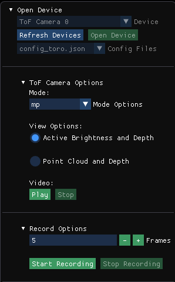
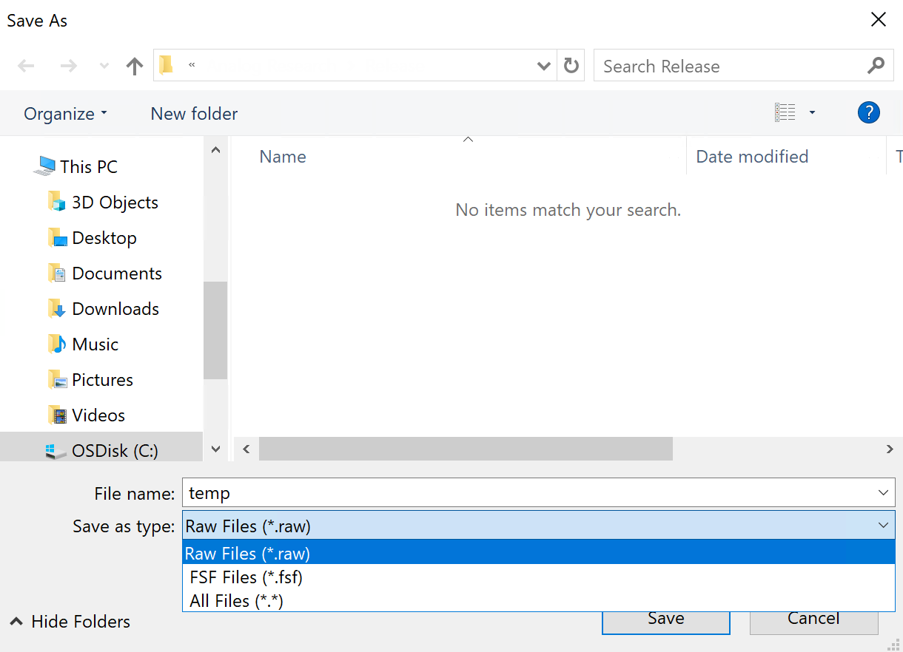
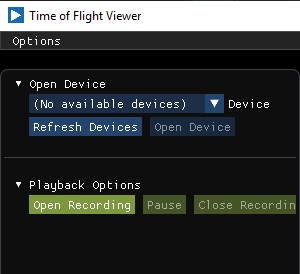
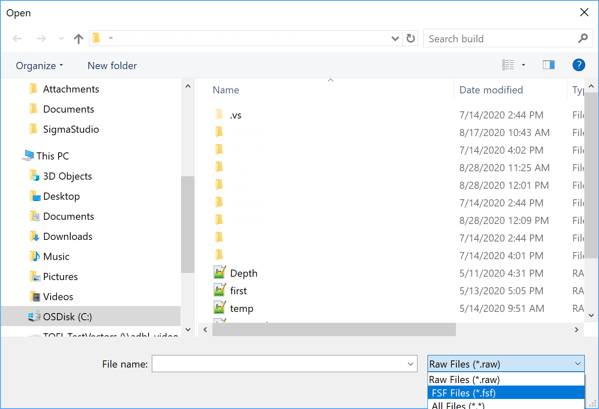
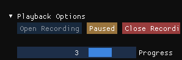
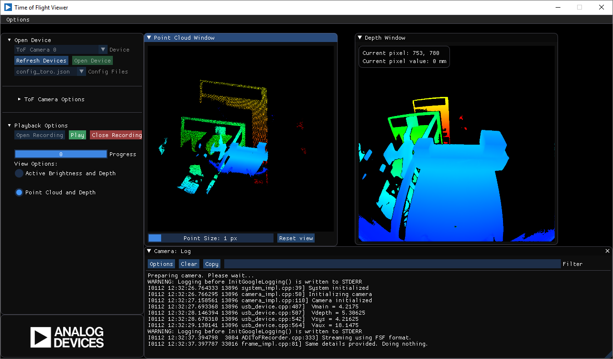

# Time of Flight Viewer by Analog Devices, Inc

Welcome to the Time of Flight Viewer Graphical User Interface.
This evaluation software is under active development and this release is a Beta revision.

## Introduction

**Time of Flight Viewer** is a cross platform (Linux and Windows) tool that reads data from all supported ADI camera modules. The current supported camera modules are:

* Walden (+ Frame Grabber).

## Viewer Contents

The Viewer enables users to visualize:

* Depth map
* Active brightness image
* Point cloud

## How to Use the Viewer

When running the Viewer environment a window will show as depicted in Figure 1

**Figure 1**

Under "Open Device" section, there is a drop-down widget that will display the supported connected cameras on the computer. If no supported cameras are connected, 
then it will only show "(No available devices)". After connecting a supported camera, push the "Refresh Devices" button to refresh the camera list display. In Figure 1, "ToF Camera 0" has been detected and is ready for use.

The Viewer might support different configuration files, these files will be displayed in a drop-down box labeled "Config Files". Select a configuration file suggested by ADI.

Push "Open Device" button, and a menu of supported options will appear as depicted in Figure 2

**Figure 2**

Currently, the Viewer offers 1 Mega Pixel  (mp), PCM (mp_pcm), and Quarter Mega Pixel (qmp) options. Observe that Active Brightness (AB) and Depth views are in separate windows, and Point Cloud and Depth view is an alternative option.
Press the "Play" button to run the camera in Active Brightness and Depth mode as shown in Figure 3.

**Figure 3**

As depicted above, both the Active Brightness and Depth views are available. If the user wants to know the distance of the elements shown on Depth view, then the mouse needs to be hovering over the desired location of the image and the distance will then be shown in mm. See Figure 4.

**Figure 4**

Press "Stop" button to stop displaying images and the Viewer will stop the camera.
To Quit the application, go to the upper left corner and click under "Options". Then click "Quit".

## Recording and Playback

**Recording**

To record camera streams is very simple. The user must need to have a recognized camera within the Viewer as referred in Figure 2. Some features must be taken into consideration:

* Viewer "Mode" must be set to the desired configuration.
* Stream types: The only supported types are Active Brightness, Depth, and Point Cloud (XYZ).
* Number of frames to be recorded.

Refer to Figure 5.

!

**Figure 5**: *Recording Options*

Once the above options are set, then press the "Start Recording" button. The Viewer GUI will prompt a "Save As" window to pre-save the file name. It is advisable to give a unique name to the new recording file. Then, choose file format, which can be either *.raw (binary) format or *.fsf format, as depicted in Figure 6.

!

**Figure 6**: *Save As Window*

If ".raw" format is selected, then the Viewer will automaically record both Active Brightness and Depth stream formats and the recording will take place according to the chosen number of frames shown in Figure 5. After recording, a folder with name " *<user_given_name>_RAW* " will be created. Within this folder, a set of files with "*raw_frame_n-1*" naming convention and *.bin* extension will be created. Where "*n*" starts with 1 and increments up to the chosen number of frames.

If ".fsf" format is selected, Active Brightness, Depth, and Point Cloud streams will be recorded up to 300 frames. A file will be created with the following naming convention: "*<user_given_name>_XYZ.fsf*". Alternatively, another file with RAW stream will be created. This file will follow the "*<user_given_name>_RAW.fsf*" naming convention. 

**Playback**

In contrast to *Recording* option, we do not need to have a detected camera. Instead the user can go directly to "Playback Options" section and click "Open Recording" button 
! as depicted in Figure 7.

! 

**Figure 7**: *Playback options*

Once pressed, a pop-up window will show and the user must locate the recorded file. There are two filters available: ".raw" and ".fsf" to find files with ease. Refer to Figure 8.

!

**Figure 8**: *File filters*

If the recorded file is in the ".raw" format, then both Active Brightness and Depth streams will be displayed. Additionally, a progress bar will be available to rewind or fast-forward between frames. A quick tip: It is a good idea to press "Pause" button for a more convenient navigation between frames, as depicted in Figure 9.

!

**Figure 9**: *Playback Progress Bar, Pause button, and Stop Playback button.*

If the recorded file is in the ".fsf" format, only the "*<user_given_name>_XYZ.fsf*" file will be supported. This file contains Active Brightness, Depth, and Point Cloud stream information, as previously mentioned.

## Point Cloud (XYZ)

This graphical user interface supports 3D imaging by selecting "Point Cloud and Depth" option from the radio button. Both Point Cloud and Depth windows will be displayed as depicted in Figure 10.

!

**Figure 10**: *Point Cloud*

Once the Point Cloud image is displayed (window on the left), the user can analyze such image by performing the following options by hovering over the Point Cloud window:
* Zoom In/Out
	* Use the mouse wheel and scroll forward to zoom in, scroll backwards to zoom out. 
* Grab image and move it in all directions
	* Hover over the Point Cloud Image and right click the mouse button, while pressed down, move the image around. Move gently as it may be sensitive to abrupt movements. If for some reason the image is "gone", press the "Reset View" button on the bottom right side of the window, and it will bring back the image to the center. 
* Rotate image
	* Click the left mouse button and while pressed, move the mouse around to see different perspectives of the image.
* Increase / Decrease Point Cloud point size.
	* Grab the slider at the bottom of the Point Cloud window and move it left of right to decrease or increase point size.
* Reset View
	* As mentioned before, press this button to restore to default image size and position.

## Known Issues

* Active Brightness is dim or very dark.
* Point Cloud point size is not resetting.
	* When displaying Point Cloud, if the user changed the point size to a value different than one and then clicks "Reset" from the "Options" menu, then after selecting Point Cloud again, the Point size does not reset to default value of 1. To reset point size, it is necessary to click the "Reset View" button from "Point Cloud Window".
* Camera Log section is not fixed to GUI.
	* If camera log window is moved from its original position, it can obstruct the displayed images.
	* There is no "restore to original position" option.
* GUI interface does not adjust to screen resolution
	* If the screen resolution is changed, the GUI interface remains the same size and it does not automatically adjusts. It is advisable to set PC display resolution to 100% for better GUI display.
	* The "Maximize" window button is disabled.
