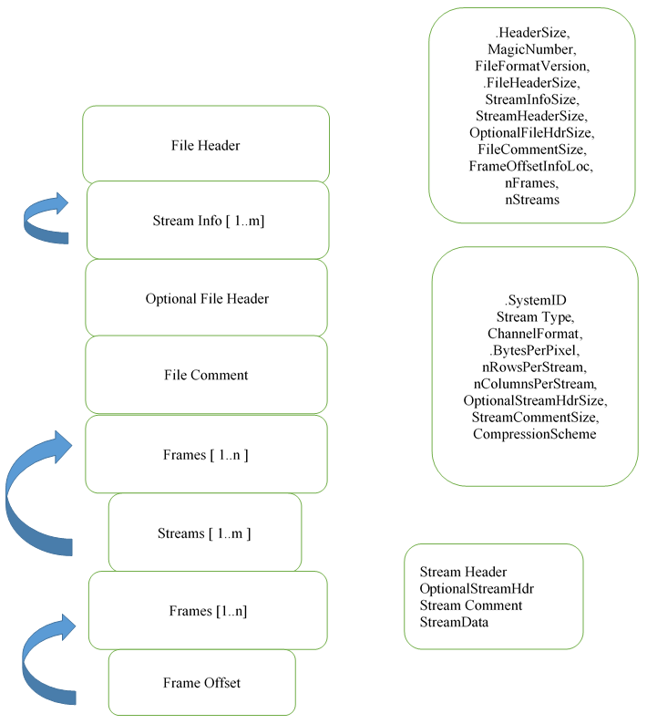

# FSF File Parser Utiliy 

## Introduction
FSF is a video file format that is used by Microsoft to store various video
data such as RAW, DEPTH, AB and XYZ. It supports the concept of streams for
each of the data type. This format allows us to capture all video information
in a single file or separate files per stream.

## FSF Format
See image below for a simplified format of FSF files.

<p align="center">
    
</p>

Detailed format can be found [here](./doc/images/FSF_full_format.png).

## Building the Project

1. Create build directory under FSF
```bash
mkdir build && cd build
```

2. Generate *CMake* files inside the build directory and call *Make*. Example
applications are always generated by default.
    * Generic project build
    ```bash
    cmake .. && make
    ```

    * Building the project with python bindings (requires Python 3)
    ```bash
    cmake .. -DWITH_PYTHON=on -DPYBIND11_PYTHON_VERSION=3 && make
    ```

    * Building the project without examples
    ```bash
    cmake .. -DWITH_EXAMPLES=off && make
    ```

## Running the Examples
Run the following commands inside the **build** directory for running the
different example applications.

### C++ Examples with the FSF API

* C++ file loopback example. Click [here](./example/file_loopback.cpp) for the
source code.
```bash
./example/file_loopback.exe ../data/80cm_WhiteTarget_LT.fsf Write.fsf
```

* C++ file writer example. Click [here](./example/file_writer.cpp) for the
source code.
```bash
./example/file_writer.exe
```

### C Examples with the FSF C Wrapper API

* C file loopback example. Click [here](./example_c/file_loopback.c) for the
source code.
```bash
./example_c/file_loopback_c.exe ../data/80cm_WhiteTarget_LT.fsf Write.fsf
```

* C file writer example. Click [here](./example_c/file_writer.c) for the
source code.
```bash
./example_c/file_writer_c.exe
```

### Python Example (Requires Python3)
* Python file loopback example. Click [here](./bindings/python/fsf_example.py)
for the source code.
```bash
python3 bindings/python/fsf_example.py ../data/80cm_WhiteTarget_LT.fsf Write.fsf
```

## API Documentation
Full FSF API documentation including the C wrapper functions can be found in
the [FSF document](./doc/FSF.docx).
